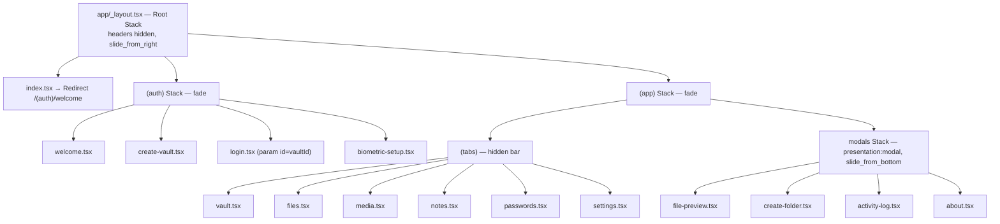

# 02 — Navigation

File-based routing via **expo-router ~6.0.24**. All navigation is programmatic (`router.push`/`router.replace`); no deep-link schemes are registered.

## 1. Route Tree (Mermaid)

## 2. Container Definitions

| Container | Animation | Header | File |
|---|---|---|---|
| Root Stack | `slide_from_right` (200ms); `(auth)`/`(app)` groups `fade` | hidden | `app/_layout.tsx:26-38` |
| Auth Stack | `slide_from_right` (200ms) | hidden | `app/(auth)/_layout.tsx:8-21` |
| App Stack | `slide_from_right` (200ms); `(tabs)` fade | hidden | `app/(app)/_layout.tsx:8-19` |
| Tabs | — | hidden; **tab bar hidden** (`display:none, height:0`) | `app/(app)/(tabs)/_layout.tsx:12-30` |
| Modals Stack | `slide_from_bottom` (250ms), `presentation:'modal'` | hidden | `app/(app)/modals/_layout.tsx:8-21` |

## 3. Navigation Calls (evidence)

| From | Action | To | File:Line |
|---|---|---|---|
| index.tsx | `Redirect` | `/(auth)/welcome` | `app/index.tsx:4` |
| welcome | push | `/(auth)/create-vault` | `app/(auth)/welcome.tsx:18` |
| welcome | push | `/(auth)/login` | `app/(auth)/welcome.tsx:19` |
| create-vault | replace | `/(app)/(tabs)/vault` | `app/(auth)/create-vault.tsx:69` |
| biometric-setup | replace | `/(app)/(tabs)/vault` | `app/(auth)/biometric-setup.tsx:25,30` |
| login (PIN ok) | replace | `/(app)/(tabs)/vault?vaultId=` | `app/(auth)/login.tsx:65,82` |
| vault quick cards | push | `/(app)/(tabs)/{files,media,notes,passwords}?vaultId=` | `app/(app)/(tabs)/vault.tsx:48-75` |
| vault | push | `/(app)/(tabs)/settings` | `app/(app)/(tabs)/vault.tsx:78` |
| files | push | `/(app)/modals/file-preview?fileName&uri` | `app/(app)/(tabs)/files.tsx:177` |
| settings | push | `/(app)/modals/activity-log` / `about` | `app/(app)/(tabs)/settings.tsx:220,224` |
| AddOptionsSheet | push | files / media / notes / passwords / exit | `src/ui/components/organisms/AddOptionsSheet.tsx:42-83` |
| VaultListSheet | push | `/(auth)/login?id=` (locked vault) | `src/ui/components/organisms/VaultListSheet.tsx:35` |
| VaultListSheet | push | `/(auth)/create-vault` | `src/ui/components/organisms/VaultListSheet.tsx:40` |
| settings lock-all | push | `/(auth)/welcome` | `app/(app)/(tabs)/settings.tsx:237` |
| settings clear-all | replace | `/(auth)/welcome` | `app/(app)/(tabs)/settings.tsx:212` |
| SessionProvider auto-lock | replace | `/(auth)/login` | `src/ui/providers/SessionProvider.tsx:91` |

## 4. Parameter Passing

- `?vaultId=` (string) passed to files/media/notes/passwords — e.g. `vault.tsx:52-65`. Screens default to `'default'` when absent (`media.tsx:25`, `files.tsx:35`, `notes.tsx:25`).
- `?id=` on login selects the target vault (`login.tsx:28`).
- `?fileName&uri` on file-preview (`files.tsx:177`).

## 5. Android Hardware Back

- `vault.tsx:68-72`: QuickExit card calls `BackHandler.exitApp()` (Android) or pushes `/(auth)/welcome` (other).
- `AddOptionsSheet.tsx:76-83`: same QuickExit pattern.

## 6. Navigation Rules Observed

1. Auth → App is always `replace` (no back into forms).
2. Tabs are push-driven; the Tab bar is never visible.
3. Every ScreenLayout shows a custom `Header` with back arrow (`showBack`) instead of native headers.
4. Modals open with bottom-sheet-style slide and are dismissed via `router.back()`.
