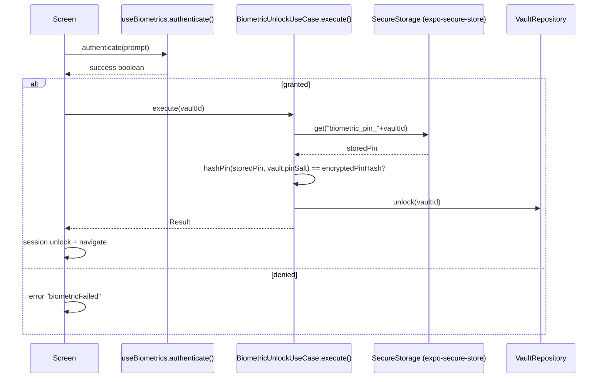

# 05 — Biometric Authentication

## 1. Module

`expo-local-authentication ~17.0.8` wrapped by `src/ui/hooks/useBiometrics.ts`. App config permission: `android.permission.USE_BIOMETRIC` (`app.json`), iOS `NSFaceIDUsageDescription` (`app.json`).

## 2. Hook API (`useBiometrics.ts`)

| Member | Returns | Purpose |
|---|---|---|
| `isAvailable` | `boolean` | Hardware + enrollment available |
| `isEnrolled` | `boolean` | Enrollment present |
| `biometryType` | `'face' \| 'fingerprint' \| 'iris' \| null` | Detected modality |
| `checkBiometrics()` | `Promise<void>` | Re-detect capability |
| `authenticate(prompt?)` | `Promise<boolean>` | Show system biometric prompt |

### Detection logic (`:33-71`)
1. Web → disabled (`:34-37`).
2. `hasHardwareAsync()` → disabled if none (`:39-43`).
3. `isEnrolledAsync()` → disabled if none (`:45-49`).
4. `getEnrolledLevelAsync()`: level `2` → face, else fingerprint (`:53-55`); fallback to `supportedAuthenticationTypesAsync()` with preference face → iris → first (`:56-64`).
5. `setState({isAvailable:true, isEnrolled, biometryType})` (`:66-70`).

### Authenticate (`:75-89`)
- `authenticateAsync({ promptMessage, fallbackLabel:'Use PIN', cancelLabel:'Cancel', disableDeviceFallback:false })` → `result.success`. Errors swallowed → `false`.

## 3. Secure Storage of Biometric Token

`BiometricUnlockUseCase` (`src/domain/usecases/auth/BiometricUnlockUseCase.ts`):

| Method | Behavior | File:Line |
|---|---|---|
| `execute(vaultId)` | Read `biometric_pin_{id}`, re-hash with vault salt, compare, unlock | `:14-34` |
| `storeBiometricPin(vaultId,pin)` | Store **plaintext PIN** under `biometric_pin_{id}` | `:36-41` |
| `hasBiometricPin(vaultId)` | `contains()` check | `:43-47` |
| `removeBiometricPin(vaultId)` | delete key | `:49-53` |

Storage backend: `SecureStorageSource` (`expo-secure-store`, `WHEN_UNLOCKED_THIS_DEVICE_ONLY`) — see `SecureStorageSource.ts:8-10`.

## 4. Where Biometrics Are Invoked

| Screen | Trigger | Purpose | File:Line |
|---|---|---|---|
| login.tsx | "biometric" button | unlock target vault | `:73-86` |
| create-vault.tsx | after vault creation | store PIN for biometric | `:67-68` |
| biometric-setup.tsx | "Enable" button | authenticate then set `biometric_enabled=true` | `:20-27` |
| settings.tsx | biometrics toggle | authenticate before toggling flag | `:72-82` |

## 5. Flow (Mermaid)

## 6. Security Notes

1. **Plaintext PIN at rest**: `storeBiometricPin` stores the PIN itself (not an encryption token). Compromise of SecureStore (device-rooted) exposes the PIN.
2. **No biometric-only gating in the use case**: `BiometricUnlockUseCase.execute` does not itself require a fresh biometric success — the UI layer calls `authenticate()` first. A caller could invoke `execute()` without a biometric check.
3. **`biometric_enabled` flag** (`biometric-setup.tsx:13`, `settings.tsx:81`) is informational; login screen shows the biometric button whenever `isAvailable` regardless of this flag (`login.tsx:167`).
4. **Consistency gap**: `biometric-setup.tsx` is unreachable from the flow (no caller found — dead route). Biometric PIN is still stored at vault creation, so the biometric button appears on login regardless.
5. Lockout (5 attempts / 5 min) applies only to **PIN** path; biometric path bypasses failed-attempt tracking.
