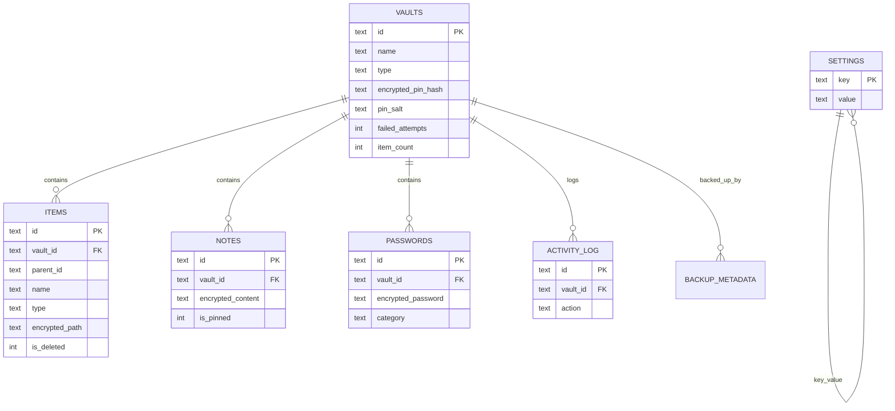

# 08 — Database Schema

## 1. Engine & Connection (`DatabaseService.ts`)

- `expo-sqlite` sync API: `openDatabaseSync('khaznati.db')` (`:17`).
- PRAGMAs (`:31-41`): optional `key` (encryption, silent fallback), `journal_mode=WAL`, `synchronous=NORMAL`, `cache_size=-4000`, `temp_store=MEMORY`, `foreign_keys=ON`.
- Query helpers: `executeSql`, `query`, `queryOne`, `transaction` (BEGIN/COMMIT/ROLLBACK), `close`, `backup`, `restore`, `getVersion/setVersion`, `integrityCheck` (`:53-164`).
- `withRetry` wraps all DB calls (`:56-85`).

## 2. Tables (from `SCHEMA`, `src/data/database/schema.ts`)

### vaults (`:3-20`)
| Column | Type | Notes |
|---|---|---|
| id | TEXT PK | UUID |
| name | TEXT | |
| type | TEXT | default 'personal' |
| icon | TEXT | default 'shield-lock' |
| color | TEXT | default '#6C63FF' |
| created_at / updated_at | INTEGER | ms epoch |
| last_accessed_at | INTEGER NULL | |
| is_locked | INTEGER | default 1 |
| encrypted_pin_hash | TEXT | |
| pin_salt | TEXT | |
| failed_attempts | INTEGER | default 0 |
| locked_until | INTEGER NULL | |
| item_count | INTEGER | default 0 |
| total_size | INTEGER | default 0 |
| backup_version | INTEGER | default 0 |

### items (`:22-40`)
| Column | Type | Notes |
|---|---|---|
| id | TEXT PK | |
| vault_id | TEXT FK→vaults(id) CASCADE | |
| parent_id | TEXT NULL | folder hierarchy |
| name | TEXT | |
| type | TEXT | folder/image/video/audio/document/file/note/password |
| mime_type | TEXT NULL | |
| size | INTEGER | default 0 |
| encrypted_path | TEXT NULL | file URI |
| encrypted_data | TEXT NULL | |
| thumbnail_path | TEXT NULL | |
| metadata_json | TEXT NULL | |
| is_favorite / is_deleted | INTEGER | default 0 |
| created_at / updated_at / deleted_at | INTEGER | |

### notes (`:42-53`)
id, vault_id FK CASCADE, title TEXT (default ''), encrypted_content TEXT, is_encrypted (default 1), color TEXT NULL, is_pinned (default 0), created_at, updated_at.

### passwords (`:55-69`)
id, vault_id FK CASCADE, service_name, service_url NULL, username NULL, encrypted_password, category NULL, notes NULL, strength_score (default 0), created_at, updated_at, last_used_at NULL.

### activity_log (`:71-80`)
id PK, vault_id FK CASCADE NULL, action TEXT, target_type NULL, target_id NULL, metadata_json NULL, created_at.

### settings (`:82-86`)
key TEXT PK, value TEXT, updated_at.

### backup_metadata (`:88-95`)
id PK, version, created_at, file_size NULL, checksum NULL, is_encrypted (default 1).

### Indexes (in `SCHEMA`, `:97-107`)
`idx_items_vault_id`, `idx_items_parent_id`, `idx_items_type`, `idx_items_deleted`, `idx_items_favorite`, `idx_notes_vault_id`, `idx_notes_pinned`, `idx_passwords_vault_id`, `idx_passwords_category`, `idx_activity_log_created`, `idx_activity_log_action`.

## 3. Entity-Relationship (Mermaid)

## 4. Migration Table (runtime)

`_migrations(version PK, name, applied_at)` created by `MigrationRunner.run` (`MigrationRunner.ts:22-28`). Effective current version = max(PRAGMA user_version, max(_migrations)).

## 5. Data Notes

- **Foreign keys** rely on `PRAGMA foreign_keys=ON` (`DatabaseService.ts:41`) for CASCADE deletes of vault children.
- `vault_id` in `activity_log` is inserted as `undefined` (`ActivityLogRepositoryImpl.ts:30`) → stored as NULL.
- `backup_metadata` table exists but is **never written** by any code (dead table).
- Items keep both `encrypted_path` (URI) and `encrypted_data` (payload) columns; current flows write only `encrypted_path`.
