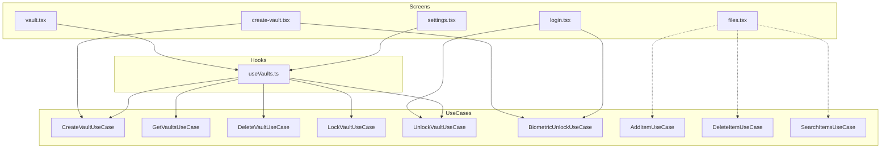

# 11 — Use Cases Registry

All use cases live in `src/domain/usecases/`. They implement the business rules and return `Result<T>`.

## 11.1 Vault Use Cases

### CreateVaultUseCase (`vault/CreateVaultUseCase.ts`)
- **Input**: `CreateVaultInput { name, type, pin, icon?, color? }` (`:9-15`).
- **Validates**: name + PIN via `validateVaultName`/`validatePin` (`:24-32`).
- **Creates**: salt, hashPin, Vault entity (defaults icon/color) (`:34-55`).
- **Side effect**: `biometricUnlockUseCase.storeBiometricPin(vault.id, pin)` on success (`:58-60`).
- **Consumed by**: `useVaults.createVault` → create-vault.tsx (`useVaults.ts:33-39`).

### GetVaultsUseCase (`vault/GetVaultsUseCase.ts`)
- `execute()` → `vaultRepository.findAll()` (`:8-10`). Consumed by `useVaults` on mount.

### DeleteVaultUseCase (`vault/DeleteVaultUseCase.ts`)
- `execute(id)` → `vaultRepository.delete(id)` (`:7-9`). Consumed by settings clear-all via `useVaults`.

### LockVaultUseCase (`vault/LockVaultUseCase.ts`)
- `execute(id)` → `lock(id)` (`:7-9`). Consumed by settings lock-all.

### UnlockVaultUseCase (`vault/UnlockVaultUseCase.ts`)
- **Logic**: lockout (5/5min), hashPin compare, counters, unlock — full detail in `04-Authentication-Flow.md` §4.
- **Consumed by**: `useVaults.unlockVault` → login.tsx.

## 11.2 Item Use Cases

### AddItemUseCase (`item/AddItemUseCase.ts`)
- **Input**: `AddItemInput` (`:7-17`).
- Validates name non-empty (`:23-25`), builds Item, `create()` (`:27-47`).
- **Consumed by**: none (registered in DI but screens use `ItemRepository` directly — see `14`).

### DeleteItemUseCase (`item/DeleteItemUseCase.ts`)
- `execute(id, permanent=false)` → `delete()` if permanent else `softDelete()` (`:7-12`).
- **Consumed by**: none directly (dead registration).

### SearchItemsUseCase (`item/SearchItemsUseCase.ts`)
- `execute(vaultId, query)` → search or full list if empty (`:8-13`).
- **Consumed by**: none directly.

## 11.3 Auth Use Case

### BiometricUnlockUseCase (`auth/BiometricUnlockUseCase.ts`)
- `execute(vaultId)` / `storeBiometricPin` / `hasBiometricPin` / `removeBiometricPin` (`:14-53`).
- **Consumed by**: login.tsx (`:78`), create-vault.tsx (`:67`).

## 11.4 Usage Graph (Mermaid)

> Dashed links (`AddItem/DeleteItem/SearchItems`) represent **registered but not resolved** use cases — screens call repository methods directly (e.g. `files.tsx:45-48,98`).
