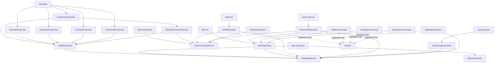

# 12 — Dependency Injection

## 1. Container (`src/core/di/container.ts`)

Custom Service Locator with:
- `registerSingleton(key, factory)` — caches one instance.
- `registerTransient(key, factory)` — new instance per resolve.
- `resolve<T>(key)` — get instance.
- Circular-dependency detection in resolve (reported by earlier survey; verified registration is top-down).
- Keys are plain strings (not symbols).

## 2. Registration Catalogue (`src/core/di/register.ts`)

All registrations are **singletons** (`:35-104`):

| Token | Factory creates | Constructor deps | Line |
|---|---|---|---|
| `DatabaseService` | DatabaseService | — | `:35` |
| `SecureStorageSource` | SecureStorageSource | — | `:36` |
| `FileSystemSource` | FileSystemSource | SecureStorageSource | `:37-39` |
| `MigrationRunner` | MigrationRunner | (pre-registered migrations) | `:43` |
| `VaultRepository` | VaultRepositoryImpl | db | `:46-48` |
| `ItemRepository` | ItemRepositoryImpl | db | `:49-51` |
| `NoteRepository` | NoteRepositoryImpl | db, secure | `:52-57` |
| `PasswordRepository` | PasswordRepositoryImpl | db, secure | `:58-63` |
| `ActivityLogRepository` | ActivityLogRepositoryImpl | db | `:64-66` |
| `SettingsRepository` | SettingsRepositoryImpl | db | `:67-69` |
| `CreateVaultUseCase` | CreateVaultUseCase | VaultRepository, BiometricUnlockUseCase | `:72-77` |
| `GetVaultsUseCase` | GetVaultsUseCase | VaultRepository | `:78-80` |
| `DeleteVaultUseCase` | DeleteVaultUseCase | VaultRepository | `:81-83` |
| `LockVaultUseCase` | LockVaultUseCase | VaultRepository | `:84-86` |
| `UnlockVaultUseCase` | UnlockVaultUseCase | VaultRepository | `:87-89` |
| `AddItemUseCase` | AddItemUseCase | ItemRepository | `:90-92` |
| `DeleteItemUseCase` | DeleteItemUseCase | ItemRepository | `:93-95` |
| `SearchItemsUseCase` | SearchItemsUseCase | ItemRepository | `:96-98` |
| `BiometricUnlockUseCase` | BiometricUnlockUseCase | VaultRepository, SecureStorageSource | `:99-104` |

> `CreateVaultUseCase` depends on `BiometricUnlockUseCase`, which is registered *after* — order is safe because factories resolve lazily at first `resolve()`, and `registerDependencies()` completes before any `resolve` runs at boot (`app/_layout.tsx:69`).

## 3. Consumers (resolve sites)

| Resolved token | Consumer | File:Line |
|---|---|---|
| `DatabaseService` | app/_layout | `app/_layout.tsx:70` |
| `MigrationRunner` | app/_layout | `app/_layout.tsx:72` |
| `SecureStorageSource` | SessionProvider | `SessionProvider.tsx:38` |
| `GetVaults/CreateVault/Delete/Lock/UnlockVaultUseCase` | useVaults hook | `useVaults.ts:15-19` |
| `BiometricUnlockUseCase` | login, create-vault | `login.tsx:78`, `create-vault.tsx:67` |
| `ItemRepository` | files | `files.tsx:46` |
| `NoteRepository` | notes | `notes.tsx:38` |
| `PasswordRepository` | passwords | `passwords.tsx:46` |
| `ActivityLogRepository` | activity-log modal | `activity-log.tsx:41,57` |

## 4. Dependency Graph (Mermaid)

## 5. Observations

1. DI container holds 19 singletons; 3 repositories (FileSystemSource, SettingsRepository) and 3 item use cases are **never resolved** (dead registrations — see `14`).
2. The container is module-level global; hooks resolve inside render bodies (`useVaults.ts:15-19`) without `useMemo` on the container itself — fine since singletons.
3. No testability seams (no injection of mocks via container in app runtime); unit tests construct classes directly.
