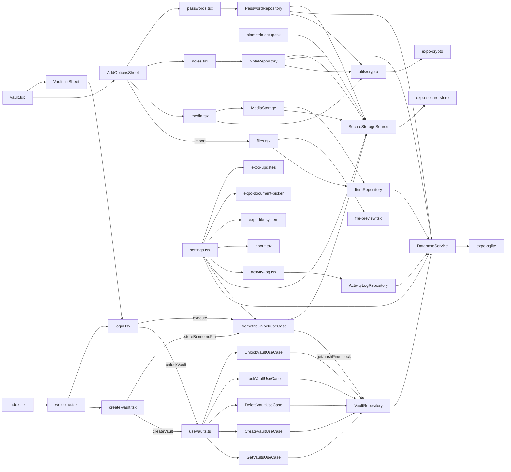

# 13 — Dependency & Call Graph

Cross-cutting call graph: screen → hook/component → use case → repository → database/core.

## 1. Full Call Graph (Mermaid)

## 2. Layer Boundaries

| Direction | Allowed | Evidence |
|---|---|---|
| app → ui/domain/data/core | yes | screens import components + DI tokens |
| ui → domain | yes | hooks call use cases |
| ui → data | yes | activity-log resolves `ActivityLogRepositoryImpl` directly (`activity-log.tsx:11,41`) |
| domain → data | **no (by design)** | domain only knows interfaces; data implements them |
| data → core | yes | repositories import `@core/errors`, `@core/utils/crypto` |
| core → external libs | yes | crypto uses expo-crypto |

**Violation noted**: `ui/providers/SessionProvider.tsx:5` imports `SecureStorageSource` (data) directly; `media.tsx` imports `MediaStorage` (data) and `encryptFile/decryptFile` (core) directly; screens import DTO/repository impls. Pragmatic shortcuts that skip interface indirection.

## 3. Module Import Hotspots (frequently imported)

| Module | Imported by |
|---|---|
| `@core/utils` (index) | ~everywhere (id, time, logger, resilience, secure) |
| `@core/theme` | all UI + screens (spacing/colors/typography) |
| `@core/errors` | all domain + data |
| `@core/di/container` | all hooks + screens using DI |
| `@ui/providers/ThemeProvider` | all UI + screens |
| `react-i18next` `useTranslation` | all screens |

## 4. Circular Dependency Risk Assessment

- `CreateVaultUseCase → BiometricUnlockUseCase → VaultRepository` (no cycle).
- `useVaults` resolves 5 use cases each render — cheap (singletons) but not memoized list.
- Container resolves lazily; boot order (register → resolve) avoids cycles (`app/_layout.tsx:69-73`).

## 5. Dead Ends (resolve/import to nowhere)

- `FileSystemSource`, `SettingsRepository`, `AddItemUseCase`, `DeleteItemUseCase`, `SearchItemsUseCase` — registered only.
- Components `BottomSheet`, `Dialog`, `GlassCard`, `Snackbar`, `Skeleton`, `VaultCard`, `ItemRow`; hooks `useDebounce`, `useAppState` — exported but unused (see `14`).
