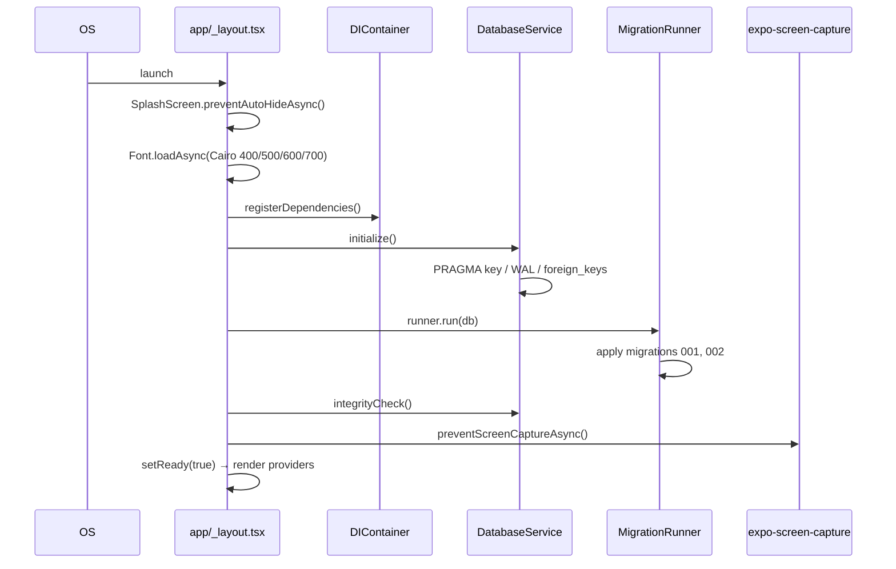
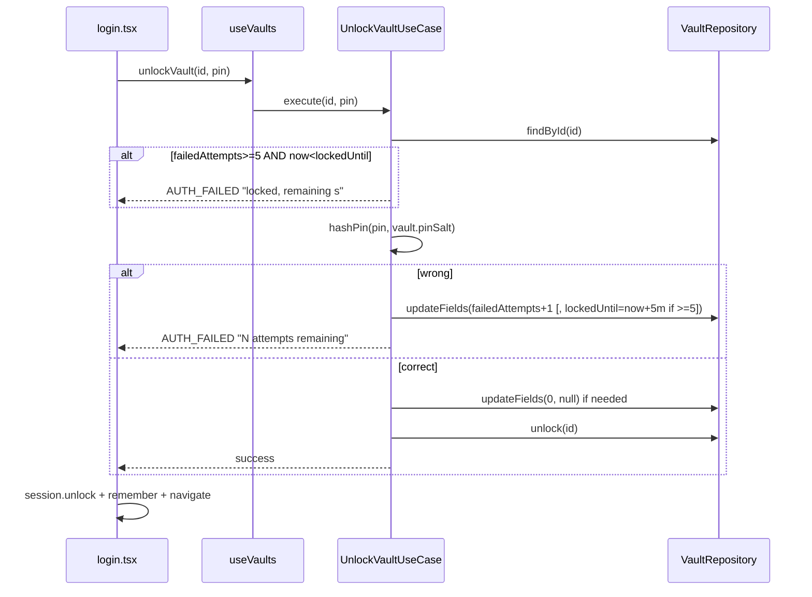
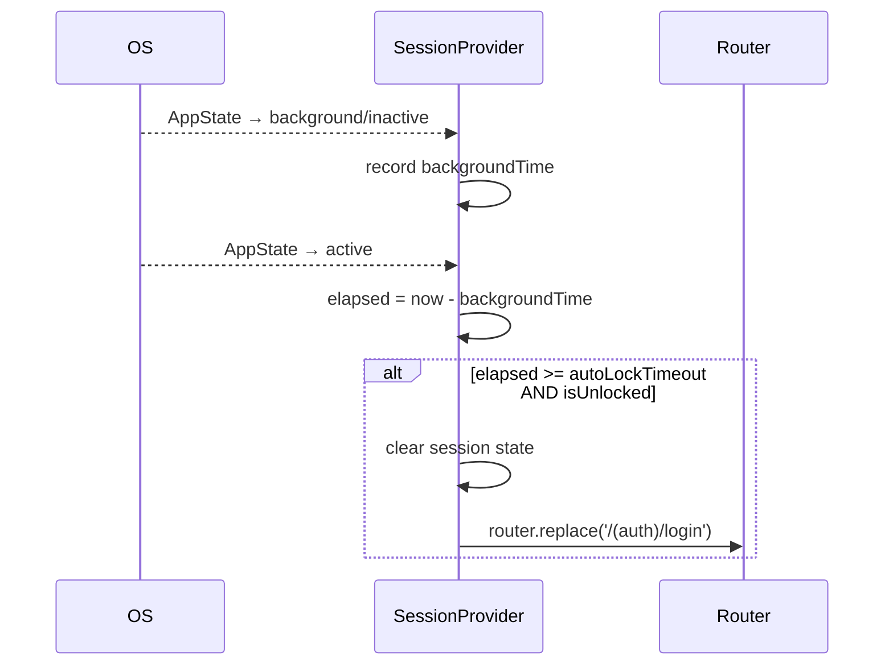
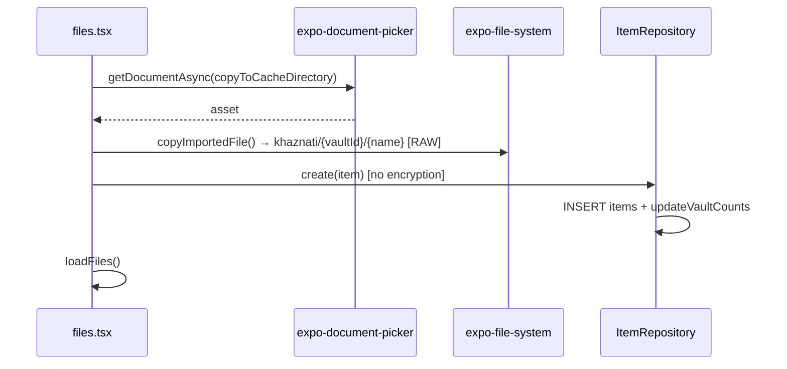
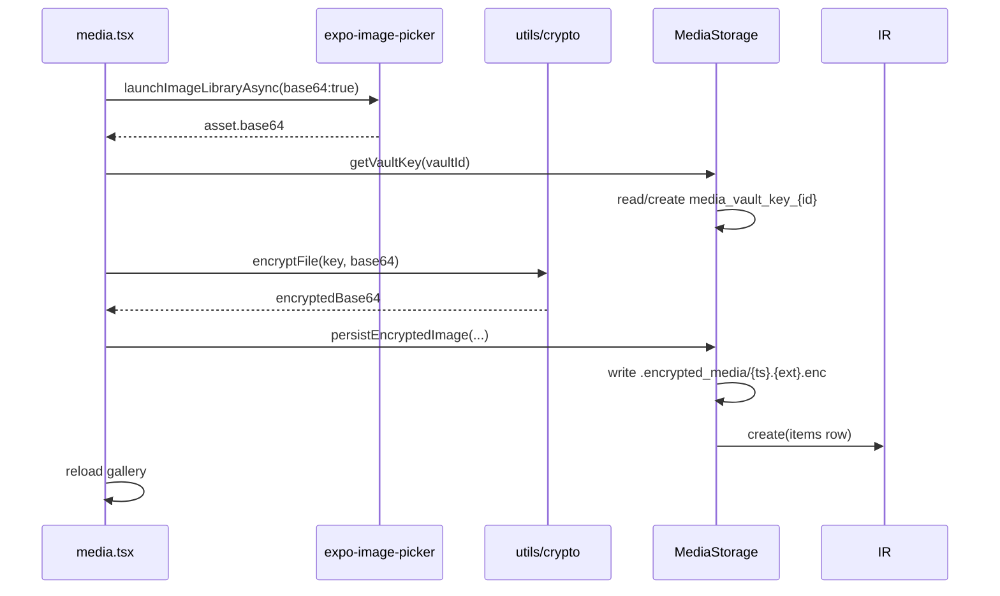
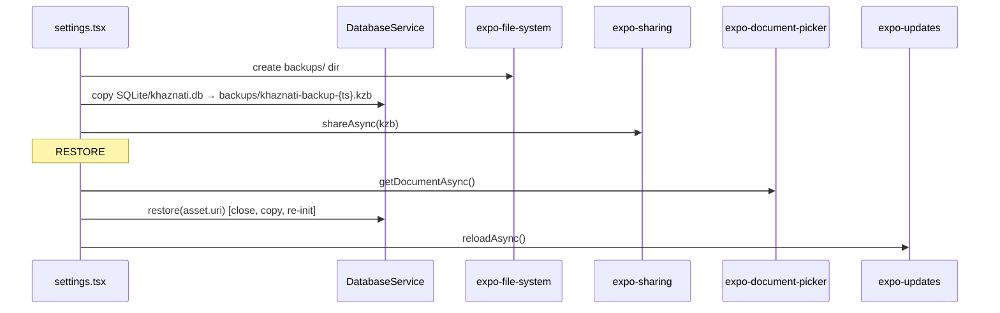

# 15 — Critical Paths (Execution Flows)

## 15.1 App Boot



## 15.2 Vault Creation → First Screen

```mermaid
sequenceDiagram
  participant W as welcome.tsx
  participant C as create-vault.tsx
  participant V as useVaults
  participant CC as CreateVaultUseCase
  participant B as BiometricUnlockUseCase
  participant VR as VaultRepository
  participant SS as SecureStorage
  W->>C: router.push(create-vault)
  C->>C: gather name/icon/color/pin
  C->>V: createVault(input)
  V->>CC: execute(input)
  CC->>CC: validate name + pin
  CC->>CC: salt = generateSalt(); hash = hashPin(pin,salt)
  CC->>VR: create(vault)
  VR->>VR: INSERT INTO vaults
  CC->>B: storeBiometricPin(id, pin)
  B->>SS: set("biometric_pin_"+id, pin)
  C->>C: router.replace(vault tab)
```

## 15.3 PIN Login (with lockout)



## 15.4 Auto-Lock on App Background



## 15.5 File Import (Files tab) — note: unencrypted



## 15.6 Media Import (encrypted)



## 15.7 Backup & Restore



## 15.8 Clear All Data / Lock All

```mermaid
sequenceDiagram
  participant S as settings.tsx
  participant V as useVaults
  participant FS as expo-file-system
  participant R as Router
  S->>V: deleteVault(id) for each vault
  V->>V: DeleteVaultUseCase → repository.delete
  S->>FS: delete khaznati/ dir
  S->>R: replace('/(auth)/welcome')
```


