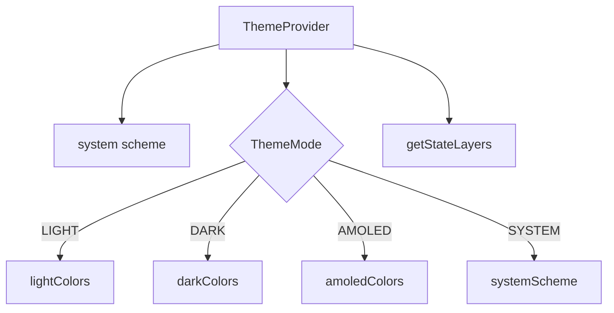

# 18 — Theme & Design System

## 18.1 Architecture

`ThemeProvider` (`src/ui/providers/ThemeProvider.tsx`) + palette definitions (`src/core/theme/colors.ts`). Mode persisted via React state only (no SecureStore persistence for theme).

## 18.2 Modes

| Mode | Behavior | File:Line |
|---|---|---|
| SYSTEM (default) | follows `useColorScheme()` | `ThemeProvider.tsx:27-31` |
| LIGHT | `lightColors` | `:34-39` |
| DARK | `darkColors` | same |
| AMOLED | `amoledColors` (pure black bg) | same |

Cycle order in UI: SYSTEM → LIGHT → DARK → AMOLED (`settings.tsx:102-107`).

## 18.3 Color Palettes (`colors.ts`)

- **Light** (`:2-51`): primary `#6C63FF`, secondary `#03DAC5`, tertiary `#FF6584`, background `#FFFFFF`, surface `#F0F2F8`, gradient start `#6C63FF`→`#9C27B0`→`#03DAC5`, premium gold/silver/platinum/rose.
- **Dark** (`:54-103`): primary `#B0A5FF`, background `#121212`, surface `#1E1E2E`.
- **AMOLED** (`:106-111`): dark + background `#000000`, surface `#0A0A0A`, surfaceVariant `#141414`.
- `ThemeColors = typeof lightColors` (`:114`) — all palettes structurally identical.

Extra semantic tokens: `success #2E7D32`, `warning #F57F17`, `info #1565C0`, glass colors, scrim, inverse surfaces.

## 18.4 Typography (`typography.ts`)

Material Design type scale, all using **Cairo** font family (`:3,22`):
`displayLarge(57) → labelSmall(11)`; `mono` uses Menlo/monospace on iOS/Android (`:22`).

## 18.5 Supporting Theme Files (`src/core/theme/`)

| File | Exports |
|---|---|
| `spacing.ts` | spacing scale (xs→xxxl) |
| `breakpoints.ts` | responsive breakpoints |
| `elevation.ts` | shadow/elevation presets (used in vault.tsx, AddOptionsSheet) |
| `icons.ts` | icon name registry |
| `motion.ts` | animation durations |
| `neu.ts` | neumorphic tokens |
| `state.ts` | `getStateLayers(colors,isDark)` → StateLayer for primary/surface/surfaceVariant/error |
| `index.ts` | barrel |

## 18.6 Consumed Design Tokens

- `spacing.*` used in every screen style object.
- `elevations[n]` used: vault card grid (`vault.tsx:109`), FAB (`:181`), sheets (`AddOptionsSheet.tsx:132`, `VaultListSheet.tsx:106`).
- `borderRadius.*` used in cards/sheets (`vault.tsx:157-162`, sheets).
- `gradient` used in welcome hero (`welcome.tsx:30`).
- `stateLayers` exposed by provider but not directly consumed by components in survey.
- `neu.ts`, `motion.ts`, `breakpoints.ts`, `icons.ts` — exported; usage limited (design-system surface for future).

## 18.7 Responsive Hook

`useResponsive` (`src/ui/hooks/useResponsive.ts`) — `scaleSize` used for welcome hero paddings (`welcome.tsx:16,33`). Other screens use `Dimensions.get('window')` directly (`vault.tsx:14`, `create-vault.tsx:25`).
