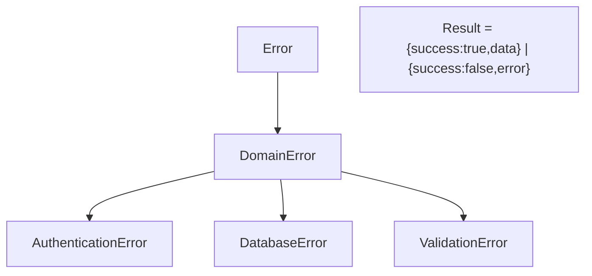

# 25 — Error Handling

## 25.1 Error Model (`src/core/errors/index.ts`)



| Class | Code | Construct | Line |
|---|---|---|---|
| `DomainError` | — | (message, code, metadata?) | `:2-13` |
| `AuthenticationError` | `AUTH_FAILED` | reason → metadata.reason | `:16-20` |
| `DatabaseError` | `DATABASE_ERROR` | message + cause | `:23-27` |
| `ValidationError` | `VALIDATION_ERROR` | field + reason | `:30-37` |
| `success(data)` / `failure(error)` | — | factories | `:45-51` |

## 25.2 Error Handling Pattern (data + domain)

Every repository method:
```ts
try { ...db call... return success(result); }
catch (e) { return failure(new DatabaseError('msg', (e as Error).message)); }
```
Examples: `VaultRepositoryImpl.ts:15-30`, `NoteRepositoryImpl.ts:28-43`, `PasswordRepositoryImpl.ts:28-45`, `ItemRepositoryImpl.ts:16-34`, `ActivityLogRepositoryImpl.ts:17-41`.

Use cases return `failure(new ValidationError(...))` / `failure(new AuthenticationError(...))` on business-rule violations (`CreateVaultUseCase.ts:24-32`, `UnlockVaultUseCase.ts:15-52`).

## 25.3 Screen-Level Handling

| Screen | Pattern | Examples |
|---|---|---|
| Login | `setError(result.error.message)`; clears PIN | `login.tsx:67-68` |
| Create vault | `setError(result.error.message)` / catch | `create-vault.tsx:70-76` |
| Files/Media/Notes/Passwords | `setError(msg)` + `ErrorView` w/ retry | `files.tsx:38-40,75-79`, `media.tsx:51-56` |
| Settings | `Alert.alert(t('common.error'), msg)` on backup/restore | `settings.tsx:157-159,190-192` |
| File preview | `setError` + ErrorView | `file-preview.tsx:53-56` |

## 25.4 Silent Failure Modes (documented)

| Location | Behavior | Risk |
|---|---|---|
| `decryptData` / `decryptFile` | return `'[encrypted]'` / `''` on any error | data appears "encrypted" when tampered/undecryptable; no user-visible error |
| DB PRAGMA key | `catch {}` warn-only (`DatabaseService.ts:31-35`) | DB may run unencrypted silently |
| `useBiometrics.authenticate` | catch → false | indistinguishable failure |
| Repos' decrypt loops | per-entry `'[encrypted]'` | mixed decrypted/undecryptable lists |

## 25.5 Validation Errors

- `validatePin` / `validateVaultName` / `validatePassword` return `{valid,error?}` from zod (`validators/index.ts:45-59`).
- Form screens do their own checks (name non-empty, PIN match/length) before submit (`create-vault.tsx:59-61`).

## 25.6 Logging

`logger` (`src/core/utils/logger.ts`) used at boot + DB ops:
- `app/_layout.tsx:75,77,79` — integrity warning, init success/fail.
- `DatabaseService.ts:34,44,93,121,142,158` — warnings/info.

## 25.7 Error UX Summary

- All data-layer failures surface as generic messages; no error codes surfaced to user.
- No global error boundary / crash reporting (no Sentry/Bugsnag).
- React error handling relies on local try/catch + Alert/ErrorView only.
