# 00 — System Overview

> Operational System Survey (OSS) — documented without modifying the codebase.

## 1. Identity

| Field | Value |
|---|---|
| App name | Khaznati (خزنتي) |
| Package name | `com.khaznati.vault` (`app.json`) |
| Version | `1.0.0` (build 1) |
| Type | Offline-first secure digital vault (files, media, notes, passwords) |
| Monorepo location | `/home/osamah/program/my-valut` |

## 2. Technology Stack

| Layer | Technology | Evidence |
|---|---|---|
| Framework | Expo SDK 54 (React Native) | `package.json` → `"expo": "~54.0.33"` |
| React | React 19.1.0 | `package.json` |
| RN | react-native 0.81.5 | `package.json` |
| Language | TypeScript ~5.9.2 | `package.json` |
| Navigation | expo-router ~6.0.24 (file-based) | `package.json`, `app/` folder |
| Database | expo-sqlite ~16.0.10 (WAL) | `src/data/database/DatabaseService.ts` |
| State | React Context (Theme/Session) + local `useState` | `src/ui/providers/` |
| DI | Custom DIContainer (Service Locator) | `src/core/di/container.ts` |
| Crypto | expo-crypto (SHA-256 stream construction) | `src/core/utils/crypto.ts` |
| Secure storage | expo-secure-store | `src/data/datasources/SecureStorageSource.ts` |
| Biometrics | expo-local-authentication | `src/ui/hooks/useBiometrics.ts` |
| i18n | i18next + react-i18next | `src/core/i18n/index.ts` |
| Validation | zod | `src/core/validators/index.ts` |
| Fonts | Cairo (Arabic-first) | `app/_layout.tsx:62` |
| Icon set | MaterialCommunityIcons | `@expo/vector-icons` |
| Tests | Jest + jest-expo + @testing-library/react-native | `jest.config.js` |
| CI/CD | GitHub Actions (3 workflows) | `.github/workflows/` |

## 3. Architecture — Clean Architecture, 5 folders

```
app/           Presentation: screens & navigators (expo-router file-based)
src/ui/        UI components, providers, hooks
src/domain/    Entities, repository interfaces, use cases (pure business logic)
src/data/      DB service, migrations, datasources, repositories, DTOs, mappers, media
src/core/      Constants, DI, errors, i18n, theme, utils, validators
```

Dependency rule: `app → src/ui → src/domain → src/data`, with `src/core` shared everywhere. The `app/` layer imports both `src/ui` (components) and `src/core`/`src/domain`/`src/data` directly (e.g. `app/(app)/(tabs)/files.tsx:18` resolves `ItemRepository` from DI).

## 4. Path Aliases (`tsconfig.json` + `metro.config.js`)

| Alias | Target |
|---|---|
| `@/*` | `src/*` |
| `@app/*` | `app/*` |
| `@ui/*` | `src/ui/*` |
| `@core/*` | `src/core/*` |
| `@domain/*` | `src/domain/*` |
| `@data/*` | `src/data/*` |

## 5. Bootstrap Sequence (`app/_layout.tsx`)

1. `SplashScreen.preventAutoHideAsync()` (`app/_layout.tsx:20`)
2. Load Cairo fonts (Regular/Medium/SemiBold/Bold) (`:62-67`)
3. `registerDependencies()` — registers all DI tokens (`:69`)
4. Resolve `DatabaseService`, `initialize()` — opens SQLite + PRAGMAs (`:70-71`)
5. Resolve `MigrationRunner`, `runner.run(db)` — applies migrations 001/002 (`:72-73`)
6. `db.integrityCheck()` (`:74`)
7. `preventScreenCaptureAsync()` — block screenshots (`:76`)
8. Render `GestureHandlerRootView > SafeAreaProvider > ThemeProvider > SessionProvider > Stack` (`:91-100`)

## 6. Navigation Containers

- Root `Stack` (`app/_layout.tsx:26`) → `(auth)` and `(app)` groups, slide_from_right, headers hidden.
- `(auth)` Stack (`app/(auth)/_layout.tsx:8`): welcome, login, create-vault, biometric-setup.
- `(app)` Stack (`app/(app)/_layout.tsx:8`): `(tabs)` + `modals`.
- `(tabs)` `Tabs` (`app/(app)/(tabs)/_layout.tsx:12`): vault, files, media, notes, passwords, settings — **tab bar hidden** (`display:none; height:0`, lines 17-20); navigation driven by `router.push`.
- `modals` Stack (`app/(app)/modals/_layout.tsx:8`): file-preview, create-folder, activity-log, about — `presentation:'modal'`, slide_from_bottom.

## 7. Feature Surface (16 screens)

6 auth + 6 tabs + 4 modals. See `03-Screens-Registry.md`.

## 8. Key Data Model

7 SQLite tables: `vaults, items, notes, passwords, activity_log, settings, backup_metadata` + migration table `_migrations` (see `08-Database-Schema.md`).

## 9. Notable Facts

- **Tab bar is hidden**; user flows are push-based — Tabs container is effectively a route group.
- 6 UI components and 2 hooks exist but are **unused (dead code)**; several DI-registered services (FileSystemSource, SettingsRepository, Item use-cases) are never resolved by screens (see `14-Hidden-Features.md`).
- Activity log repository exists and is read by the modal, but **no screen ever calls `.log()`** — the table stays empty in practice.
- Crypto implementation is a **SHA-256-based stream construction**, not a standard AES-GCM primitive despite config label `aes-256-gcm` (see `07-Encryption-Implementation.md`).
# 01 — System Files Map

Complete TypeScript/JSON source map (146 files under `app/` + `src/`). Generated during OSS survey.

## app/ — Presentation Layer (20 files)

| File | Purpose |
|---|---|
| `_layout.tsx` | Root layout: fonts, DI, DB init, migrations, providers, root Stack |
| `index.tsx` | Redirect `/ → /(auth)/welcome` |
| `(auth)/_layout.tsx` | Auth Stack container |
| `(auth)/welcome.tsx` | Onboarding / welcome (gradient hero, features, CTAs) |
| `(auth)/create-vault.tsx` | Vault creation wizard (name, icon, color, PIN) |
| `(auth)/login.tsx` | PIN + biometric login, remember-me |
| `(auth)/biometric-setup.tsx` | Biometric enable screen |
| `(app)/_layout.tsx` | App Stack container (tabs + modals) |
| `(app)/(tabs)/_layout.tsx` | Tabs container (6 tabs, hidden bar) |
| `(app)/(tabs)/vault.tsx` | Vault home (quick cards grid, FAB, sheets) |
| `(app)/(tabs)/files.tsx` | File manager (import/rename/delete/export/share) |
| `(app)/(tabs)/media.tsx` | Media gallery (encrypted images import/view/export) |
| `(app)/(tabs)/notes.tsx` | Notes CRUD + pin + search |
| `(app)/(tabs)/passwords.tsx` | Password manager (CRUD, categories, generator) |
| `(app)/(tabs)/settings.tsx` | Settings (theme, language, backup/restore, security) |
| `(app)/modals/_layout.tsx` | Modals Stack container |
| `(app)/modals/file-preview.tsx` | File/image/text preview modal |
| `(app)/modals/create-folder.tsx` | Create folder modal |
| `(app)/modals/activity-log.tsx` | Activity log viewer modal |
| `(app)/modals/about.tsx` | About / founder / contact modal |

## src/core/ — Shared Infrastructure (35 files)

| Area | Files |
|---|---|
| Constants | `constants/config.ts`, `constants/enums.ts`, `constants/index.ts` |
| DI | `di/container.ts`, `di/register.ts` |
| Errors | `errors/index.ts` (DomainError/AuthError/DatabaseError/ValidationError/Result) |
| i18n | `i18n/index.ts`, `i18n/locales/ar.json`, `i18n/locales/en.json` |
| Theme | `theme/colors.ts`, `spacing.ts`, `typography.ts`, `breakpoints.ts`, `elevation.ts`, `icons.ts`, `motion.ts`, `neu.ts`, `state.ts`, `index.ts` |
| Utils | `utils/crypto.ts`, `secure.ts`, `file.ts`, `id.ts`, `logger.ts`, `resilience.ts`, `time.ts`, `index.ts` |
| Validators | `validators/index.ts` |

## src/domain/ — Business Logic (26 files)

| Area | Files |
|---|---|
| Entities | `entities/Vault.ts`, `Item.ts`, `Note.ts`, `Password.ts`, `Settings.ts`, `ActivityLog.ts`, `index.ts` |
| Repositories (interfaces) | `repositories/IVaultRepository.ts`, `IItemRepository.ts`, `INoteRepository.ts`, `IPasswordRepository.ts`, `ISettingsRepository.ts`, `IActivityLogRepository.ts`, `ISecureStorage.ts`, `index.ts` |
| Use cases | `usecases/vault/{Create,Get,Delete,Lock,Unlock}VaultUseCase.ts`, `usecases/item/{Add,Delete,Search}ItemUseCase.ts`, `usecases/auth/BiometricUnlockUseCase.ts`, `usecases/index.ts` |

## src/data/ — Data Layer (35 files)

| Area | Files |
|---|---|
| Database | `database/DatabaseService.ts`, `MigrationRunner.ts`, `schema.ts`, `database/index.ts`, `database/migrations/001_initial.ts`, `002_indexes.ts` |
| Datasources | `datasources/SecureStorageSource.ts`, `FileSystemSource.ts`, `datasources/index.ts` |
| Repositories | `repositories/{Vault,Item,Note,Password,ActivityLog,Settings}RepositoryImpl.ts`, `repositories/index.ts` |
| DTOs | `dto/{Vault,Item,Note,Password,ActivityLog}DTO.ts`, `dto/index.ts` |
| Mappers | `mappers/{Vault,Item,Note,Password,ActivityLog}Mapper.ts`, `mappers/index.ts` |
| Media | `media/MediaStorage.ts` |
| Index | `index.ts` |

## src/ui/ — Presentation Support (49 files)

| Area | Files |
|---|---|
| Providers | `providers/ThemeProvider.tsx`, `SessionProvider.tsx` |
| Hooks | `hooks/{useVaults,useBiometrics,useSecureStorage,useAppState,useDebounce,useResponsive}.ts`, `hooks/index.ts` |
| Components atoms | `atoms/{Button,Card,Divider,EmptyState,ErrorView,Icon,Input,Loading,Skeleton,Snackbar,Typography}.tsx`, `atoms/index.ts` |
| Components molecules | `molecules/{BottomSheet,Dialog,FileRow,FloatingButton,GlassCard,Header,MediaGallery,MediaPreview,MediaThumb,SearchBar}.tsx`, `molecules/index.ts` |
| Components organisms | `organisms/{AddOptionsSheet,FilesList,ItemRow,RenameEditor,ScreenLayout,SelectionBar,VaultCard,VaultListSheet}.tsx`, `organisms/index.ts` |
| Components templates | `templates/index.ts` (empty placeholder) |
| Components index | `components/index.ts` |

## Root Config (outside app/src)

`package.json`, `app.json`, `tsconfig.json`, `babel.config.js`, `metro.config.js`, `jest.config.js`, `.eslintrc.js`, `.prettierrc`, `eas.json`, `.gitignore`, `README.md`, `packages.md`, `install.sh`, `install-offline.sh`, `docs/` (plan + vault-system), `.github/workflows/` (3), `android/`, `khaznati-release/` (APK).
# 02 — Navigation

File-based routing via **expo-router ~6.0.24**. All navigation is programmatic (`router.push`/`router.replace`); no deep-link schemes are registered.

## 1. Route Tree (Mermaid)

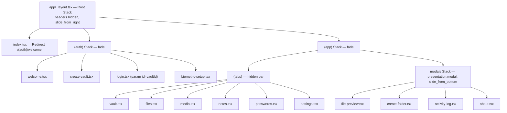

## 2. Container Definitions

| Container | Animation | Header | File |
|---|---|---|---|
| Root Stack | `slide_from_right` (200ms); `(auth)`/`(app)` groups `fade` | hidden | `app/_layout.tsx:26-38` |
| Auth Stack | `slide_from_right` (200ms) | hidden | `app/(auth)/_layout.tsx:8-21` |
| App Stack | `slide_from_right` (200ms); `(tabs)` fade | hidden | `app/(app)/_layout.tsx:8-19` |
| Tabs | — | hidden; **tab bar hidden** (`display:none, height:0`) | `app/(app)/(tabs)/_layout.tsx:12-30` |
| Modals Stack | `slide_from_bottom` (250ms), `presentation:'modal'` | hidden | `app/(app)/modals/_layout.tsx:8-21` |

## 3. Navigation Calls (evidence)

| From | Action | To | File:Line |
|---|---|---|---|
| index.tsx | `Redirect` | `/(auth)/welcome` | `app/index.tsx:4` |
| welcome | push | `/(auth)/create-vault` | `app/(auth)/welcome.tsx:18` |
| welcome | push | `/(auth)/login` | `app/(auth)/welcome.tsx:19` |
| create-vault | replace | `/(app)/(tabs)/vault` | `app/(auth)/create-vault.tsx:69` |
| biometric-setup | replace | `/(app)/(tabs)/vault` | `app/(auth)/biometric-setup.tsx:25,30` |
| login (PIN ok) | replace | `/(app)/(tabs)/vault?vaultId=` | `app/(auth)/login.tsx:65,82` |
| vault quick cards | push | `/(app)/(tabs)/{files,media,notes,passwords}?vaultId=` | `app/(app)/(tabs)/vault.tsx:48-75` |
| vault | push | `/(app)/(tabs)/settings` | `app/(app)/(tabs)/vault.tsx:78` |
| files | push | `/(app)/modals/file-preview?fileName&uri` | `app/(app)/(tabs)/files.tsx:177` |
| settings | push | `/(app)/modals/activity-log` / `about` | `app/(app)/(tabs)/settings.tsx:220,224` |
| AddOptionsSheet | push | files / media / notes / passwords / exit | `src/ui/components/organisms/AddOptionsSheet.tsx:42-83` |
| VaultListSheet | push | `/(auth)/login?id=` (locked vault) | `src/ui/components/organisms/VaultListSheet.tsx:35` |
| VaultListSheet | push | `/(auth)/create-vault` | `src/ui/components/organisms/VaultListSheet.tsx:40` |
| settings lock-all | push | `/(auth)/welcome` | `app/(app)/(tabs)/settings.tsx:237` |
| settings clear-all | replace | `/(auth)/welcome` | `app/(app)/(tabs)/settings.tsx:212` |
| SessionProvider auto-lock | replace | `/(auth)/login` | `src/ui/providers/SessionProvider.tsx:91` |

## 4. Parameter Passing

- `?vaultId=` (string) passed to files/media/notes/passwords — e.g. `vault.tsx:52-65`. Screens default to `'default'` when absent (`media.tsx:25`, `files.tsx:35`, `notes.tsx:25`).
- `?id=` on login selects the target vault (`login.tsx:28`).
- `?fileName&uri` on file-preview (`files.tsx:177`).

## 5. Android Hardware Back

- `vault.tsx:68-72`: QuickExit card calls `BackHandler.exitApp()` (Android) or pushes `/(auth)/welcome` (other).
- `AddOptionsSheet.tsx:76-83`: same QuickExit pattern.

## 6. Navigation Rules Observed

1. Auth → App is always `replace` (no back into forms).
2. Tabs are push-driven; the Tab bar is never visible.
3. Every ScreenLayout shows a custom `Header` with back arrow (`showBack`) instead of native headers.
4. Modals open with bottom-sheet-style slide and are dismissed via `router.back()`.
# 03 — Screens Registry

16 screens total: 4 auth + 6 tabs + 4 modals + redirect. Every screen is documented with purpose, inputs, actions, and file evidence.

## 3.1 Auth Screens

### welcome.tsx — Onboarding
- **Purpose**: App intro with gradient hero, 3 feature bullets, primary CTA.
- **Inputs**: none.
- **Actions**: "Get Started" → create-vault (`:18`); "Existing Vault" → login (`:19`).
- **UI**: `LinearGradient` hero + `FeatureItem` list (`:29-72`); responsive padding via `useResponsive().scaleSize` (`:16`).

### create-vault.tsx — Vault Creation Wizard
- **Purpose**: Create a vault: name, icon, color, PIN + confirm.
- **Inputs**: `name` (text), `selectedIcon` (8 icons, default `shield-lock`), `selectedColor` (8 colors, default `#6C63FF`), `pin`/`confirmPin` (digits only, max 8, `:45-53`).
- **Constants**: `COLORS` and `ICONS` (`:16-17`).
- **Strength meter**: `getPinStrength(pin,t)` — ≤4 weak / ≤6 fair / >6 strong (`:19-23`).
- **Submit gating**: `canSubmit = name && pin.length>=4 && pin===confirmPin` (`:42`).
- **Actions**: calls `createVault({...})` (`:65`), then `BiometricUnlockUseCase.storeBiometricPin(vaultId, pin)` (`:67-68`), then `router.replace('/(app)/(tabs)/vault')` (`:69`).
- **Note**: PIN is stored for biometric use even when user will later skip biometrics.

### login.tsx — PIN / Biometric Login
- **Purpose**: Unlock an existing vault by PIN (or biometric). Supports "remember me".
- **Inputs**: `id` param (target vault, default `vaults[0]`) (`:28,37-40`).
- **Remember-me**: `REMEMBER_KEY = 'khaznati_remember_vault'` persisted in SecureStore per vault (`:19,44-50`).
- **Actions**:
  - `unlockVault(id,pin)` → on success `session.unlock(id)` + navigate (`:59-65`).
  - Biometric button → `authenticate()` then `BiometricUnlockUseCase.execute(vaultId)` (`:73-86`).
- **Edge states**: no vaults → empty UI; unknown id → not-found UI with button to vault tab (`:93-129`).

### biometric-setup.tsx — Biometric Enrollment
- **Purpose**: Post-creation screen to enable biometric unlock.
- **Key**: `BIOMETRIC_ENABLED_KEY = 'biometric_enabled'` stored `'true'` in SecureStore (`:13,24`).
- **Actions**: Enable (authenticate + store) or Skip, both `router.replace('/(app)/(tabs)/vault')` (`:20-31`).
- **Note**: This screen is registered in the auth stack but is **not reachable** from any other screen (no `router.push` target found — dead route).

## 3.2 Tab Screens (hidden tab bar)

### vault.tsx — Vault Home
- **Purpose**: Quick access grid of 7 cards (files, photos, video, audio, notes, passwords, quick-exit) + FAB.
- **Cards**: `quickCards` array (`:38-46`); 3 columns responsive width (`:14-19`).
- **Actions**: card press → per-type navigation (`:48-75`); video/audio → files tab; quick-exit → `BackHandler.exitApp()` (`:67-73`).
- **Sheets**: `AddOptionsSheet` + `VaultListSheet` (`:133-134`).
- **Header**: title `app.name`, subtitle current vault name; right actions vault-list + settings (`:89-101`).

### files.tsx — File Manager
- **Purpose**: List/import/rename/delete/export/share files in `Paths.document/khaznati/{vaultId}`.
- **Import**: `DocumentPicker.getDocumentAsync` → `copyImportedFile()` copies raw to vault dir (`:22-31,91-121`); also writes an `items` DB row via `ItemRepository.create` (`:98-115`).
- **Note (security)**: imported files are **copied unencrypted** (no crypto applied) — see `07-Encryption-Implementation.md`.
- **Bulk ops**: SelectionBar (share/export/delete) (`:153-174`); export copies files to `Paths.cache/khaznati_export` via MediaLibrary permission (`:158-174`).
- **Rename**: inline `RenameEditor` (`:222-237`), conflict check (`:229-231`).
- **Preview**: push `file-preview` modal with `fileName&uri` (`:176-178`).

### media.tsx — Media Gallery
- **Purpose**: Encrypted photo gallery. Only `*.enc` files in `.encrypted_media` dir are listed (`:42-49`).
- **Import**: `ImagePicker` with `base64:true` → `encryptFile(key, base64)` → `persistEncryptedImage()` (`:102-128`). Key via `getVaultKey()` = `media_vault_key_{vaultId}` (`MediaStorage.ts:11`).
- **View**: decrypt file → inline `data:image/jpeg;base64,` preview (`:130-140`).
- **Export**: decrypt → temp file → `MediaLibrary.saveToLibraryAsync` (`:142-167`).
- **Bulk**: share (names only) / delete (`:78-100`).

### notes.tsx — Notes CRUD
- **Purpose**: Create/edit/delete/pin/search notes. Editing is a full-screen inline editor (`:150-182`).
- **Storage**: `NoteRepository` encrypts content with `note_vault_key_{vaultId}` at rest (see `10-Data-Repositories.md`); content is passed as plaintext through the UI (`:74-91`).
- **Sort**: pinned first then `updatedAt` desc (`:141-144`).
- **Search**: filters title + content (`:146-148`).
- **Selection**: long-press enters selection mode; batch delete (`:124-139`).

### passwords.tsx — Password Manager
- **Purpose**: CRUD password entries with categories, show/hide, copy, generator.
- **Categories**: `['social','email','finance','shopping','work','entertainment','other']` (`:24`).
- **Generator**: 16-char random from charset `:66-73` (uses `Math.random`, not CSPRNG).
- **Copy**: `Clipboard.setStringAsync` + 2s feedback (`:139-143`).
- **Storage**: `PasswordRepository` encrypts `encryptedPassword` with `pwd_vault_key_{vaultId}` (see `10`).
- **Show/hide**: per-entry `showPasswords` set (`:176-182`).

### settings.tsx — Settings
- **Purpose**: Security (biometrics, auto-lock), data (backup/restore/clear/activity), appearance (theme/language/clipboard), about/licenses, lock-all.
- **Auto-lock options**: 0 / 60s / 5m / 15m / 30m (`:64-70`), persisted via `setItem('auto_lock_timeout', ...)` (`:95`).
- **Theme cycle**: SYSTEM → LIGHT → DARK → AMOLED (`:102-114`).
- **Language toggle**: `changeLanguage()` + `forceRTL` + `Updates.reloadAsync()` (`:116-124`).
- **Backup**: copies `SQLite/khaznati.db` → `backups/khaznati-backup-{ts}.kzb` and shares (`:126-160`).
- **Restore**: `DocumentPicker` → `DatabaseService.restore(uri)` → reload (`:162-193`).
- **Clear-all**: deletes all vaults + `khaznati` dir + go to welcome (`:195-217`).
- **Lock-all**: locks every vault + go to welcome (`:231-238`).
- **Biometrics toggle**: authenticates first then flips `biometric_enabled` (`:72-82`).
- **Clipboard toggle**: writes `clipboard_protection` (flag only; no runtime behavior found) (`:84-88`).

## 3.3 Modals

### file-preview.tsx — File/Image/Text Preview
- **Purpose**: Preview image (`expo-image`), video (placeholder only), text files, or generic file info.
- **Detection**: ext → image/video/text sets (`:21-24`); `TEXT_EXTENSIONS` (`:15`).
- **Reads**: file size via `File.size`; text content via `file.text()` (`:44-52`).

### create-folder.tsx — Create Folder
- **Purpose**: Create subfolder in `khaznati/{vaultId}` via `Directory.create` (`:29-35`).
- **Note**: only creates the folder; no `items` DB row is written (inconsistent with file import).

### activity-log.tsx — Activity Log Viewer
- **Purpose**: Read latest 100 entries via `ActivityLogRepository.getRecent(100)` (`:41-45`) and clear all (`:50-63`).
- **Icons**: `ACTION_ICONS` map for 14 actions, default `information-outline` (`:16-33`).
- **Note**: `vault_id` is always `undefined` on insert (`ActivityLogRepositoryImpl.ts:30`), so entries are global.
- **Key finding**: no screen calls `.log()` anywhere — table is never populated in normal use (see `14-Hidden-Features.md`).

### about.tsx — About / Founder
- **Purpose**: Brand hero (portrait image), vision/mission/values, stats grid, features, timeline, founder, Telegram/WhatsApp links (`:54-60`).
- **Content**: static arrays + i18n keys (`:12-48`).
- **Version footer**: `Khaznati v1.0.0` (`:202`).
# 04 — Authentication Flow

## 1. Two Authentication Paths

| Path | Flow | Entry points |
|---|---|---|
| PIN | Vault PIN hash verification | login.tsx, create-vault.tsx |
| Biometric | Device biometric → stored PIN → hash verification | login.tsx, biometric-setup.tsx, settings.tsx |

## 2. PIN Hashing (core)

`hashPin(pin, salt)` in `src/core/utils/secure.ts:48-57` — **iterative SHA-256** construction:
- `hash = SHA256(hash + pin + salt)` repeated **100,000 iterations**.
- Salt generated by `generateSalt()` (`secure.ts:42-45`) — 16 random bytes → 32 hex chars.

> Note: this is a custom iterated hash, not standard PBKDF2/HMAC, despite `APP_CONFIG.security.pbkdf2Iterations` existing (unused constant — see `14`).

## 3. Vault Creation (`CreateVaultUseCase`)

`src/domain/usecases/vault/CreateVaultUseCase.ts:23-63`:
1. Validate name (`validateVaultName`) + PIN (`validatePin`) (`:24-32`).
2. `pinSalt = generateSalt()`; `encryptedPinHash = hashPin(pin, salt)` (`:34-35`).
3. Build `Vault` (default icon `shield-lock`, color `#6C63FF`, `isLocked:false`, counts 0) (`:38-55`).
4. `vaultRepository.create(vault)` (`:57`).
5. On success, if `biometricUnlockUseCase` present → `storeBiometricPin(vault.id, pin)` (`:58-60`) — stores **plaintext PIN** in SecureStore.

## 4. Unlock (PIN) — `UnlockVaultUseCase`

`src/domain/usecases/vault/UnlockVaultUseCase.ts:13-62`:
1. Load vault; fail `AUTH_FAILED` if missing (`:14-17`).
2. **Lockout check**: if `failedAttempts >= 5 && now < lockedUntil` → return remaining-seconds error (`:21-28`); else reset counters (`:29-33`).
3. `hashPin(pin, vault.pinSalt)`; compare with `vault.encryptedPinHash` (`:35-37`).
4. Wrong PIN → `failedAttempts+1`; if `>= 5` set `lockedUntil = now + 5min`; message with remaining attempts (`:38-53`).
5. Correct PIN → reset counters if needed (`:55-60`) → `vaultRepository.unlock(id)` (`:61`).

**Constants**: `MAX_ATTEMPTS=5`, `LOCKOUT_DURATION=5*60*1000` (`:5-6`).

## 5. Unlock (Biometric) — `BiometricUnlockUseCase`

`src/domain/usecases/auth/BiometricUnlockUseCase.ts:14-34`:
1. Read stored PIN from SecureStore key `biometric_pin_{vaultId}` (`:15-17`).
2. Load vault (`:22-25`).
3. `hashPin(storedPin, vault.pinSalt)` compare to `encryptedPinHash` (`:28-31`).
4. Match → `vaultRepository.unlock(vaultId)` (`:33`).
5. Storage helpers: `storeBiometricPin`, `hasBiometricPin`, `removeBiometricPin` (`:36-53`).

**Important**: `BiometricUnlockUseCase` verifies the stored PIN against the vault hash — so the device biometric prompt happens in the UI layer (`useBiometrics.authenticate`) before calling this use case.

## 6. UI Layer Sequence (login.tsx)

```mermaid
sequenceDiagram
  participant U as User
  participant L as login.tsx
  participant B as useBiometrics
  participant V as useVaults (UnlockVaultUseCase)
  participant S as SessionProvider
  U->>L: enter PIN
  L->>V: unlockVault(id, pin)
  V->>L: Result
  alt success
    L->>S: session.unlock(id)
    L->>L: remember? setItem(REMEMBER_KEY)
    L->>L: router.replace(vault)
  else failure
    L->>L: setError(message); clear PIN
  end
  U->>L: press biometric
  L->>B: authenticate(prompt)
  B->>L: boolean
  alt granted
    L->>L: BiometricUnlockUseCase.execute(id)
    L->>L: session.unlock(id); navigate
  else denied
    L->>L: setError(biometricFailed)
  end
```

## 7. Session State & Auto-Lock (`SessionProvider`)

`src/ui/providers/SessionProvider.tsx`:
- State: `activeVaultId`, `isUnlocked`, `lastActivityTime`, `autoLockTimeout` (default 300000 = 5min) (`:7-12,21-22`).
- Loads `auto_lock_timeout` from SecureStore on mount (`:37-45`).
- `unlock()` sets active vault + `isUnlocked:true` + activity timestamp (`:47-54`).
- `lock()` clears session (`:56-63`).
- **AppState listener** (`:76-97`): when app goes background records `backgroundTime`; on foreground, if `elapsed >= autoLockTimeout && isUnlocked` → clear session + `router.replace('/(auth)/login')` (`:81-92`).

## 8. Remember Me (login.tsx)

- Key `khaznati_remember_vault_{vaultId}` in SecureStore (`:19,44-50,63`).
- Only used to pre-check the checkbox UI; does **not** auto-unlock or skip PIN entry.

## 9. Auth Enums (relevant)

`AuthMethod { PIN, PASSWORD, BIOMETRIC, PATTERN }` (`enums.ts:30-35`) — only PIN and BIOMETRIC are implemented in practice; PASSWORD/PATTERN unused.

## 10. Failure Semantics

All use-case failures return `Result` with `AuthenticationError` (`code: 'AUTH_FAILED'`) (`errors/index.ts:16-20`). Screens translate `result.error.message` into UI errors (`login.tsx:67`).
# 05 — Biometric Authentication

## 1. Module

`expo-local-authentication ~17.0.8` wrapped by `src/ui/hooks/useBiometrics.ts`. App config permission: `android.permission.USE_BIOMETRIC` (`app.json`), iOS `NSFaceIDUsageDescription` (`app.json`).

## 2. Hook API (`useBiometrics.ts`)

| Member | Returns | Purpose |
|---|---|---|
| `isAvailable` | `boolean` | Hardware + enrollment available |
| `isEnrolled` | `boolean` | Enrollment present |
| `biometryType` | `'face' \| 'fingerprint' \| 'iris' \| null` | Detected modality |
| `checkBiometrics()` | `Promise<void>` | Re-detect capability |
| `authenticate(prompt?)` | `Promise<boolean>` | Show system biometric prompt |

### Detection logic (`:33-71`)
1. Web → disabled (`:34-37`).
2. `hasHardwareAsync()` → disabled if none (`:39-43`).
3. `isEnrolledAsync()` → disabled if none (`:45-49`).
4. `getEnrolledLevelAsync()`: level `2` → face, else fingerprint (`:53-55`); fallback to `supportedAuthenticationTypesAsync()` with preference face → iris → first (`:56-64`).
5. `setState({isAvailable:true, isEnrolled, biometryType})` (`:66-70`).

### Authenticate (`:75-89`)
- `authenticateAsync({ promptMessage, fallbackLabel:'Use PIN', cancelLabel:'Cancel', disableDeviceFallback:false })` → `result.success`. Errors swallowed → `false`.

## 3. Secure Storage of Biometric Token

`BiometricUnlockUseCase` (`src/domain/usecases/auth/BiometricUnlockUseCase.ts`):

| Method | Behavior | File:Line |
|---|---|---|
| `execute(vaultId)` | Read `biometric_pin_{id}`, re-hash with vault salt, compare, unlock | `:14-34` |
| `storeBiometricPin(vaultId,pin)` | Store **plaintext PIN** under `biometric_pin_{id}` | `:36-41` |
| `hasBiometricPin(vaultId)` | `contains()` check | `:43-47` |
| `removeBiometricPin(vaultId)` | delete key | `:49-53` |

Storage backend: `SecureStorageSource` (`expo-secure-store`, `WHEN_UNLOCKED_THIS_DEVICE_ONLY`) — see `SecureStorageSource.ts:8-10`.

## 4. Where Biometrics Are Invoked

| Screen | Trigger | Purpose | File:Line |
|---|---|---|---|
| login.tsx | "biometric" button | unlock target vault | `:73-86` |
| create-vault.tsx | after vault creation | store PIN for biometric | `:67-68` |
| biometric-setup.tsx | "Enable" button | authenticate then set `biometric_enabled=true` | `:20-27` |
| settings.tsx | biometrics toggle | authenticate before toggling flag | `:72-82` |

## 5. Flow (Mermaid)

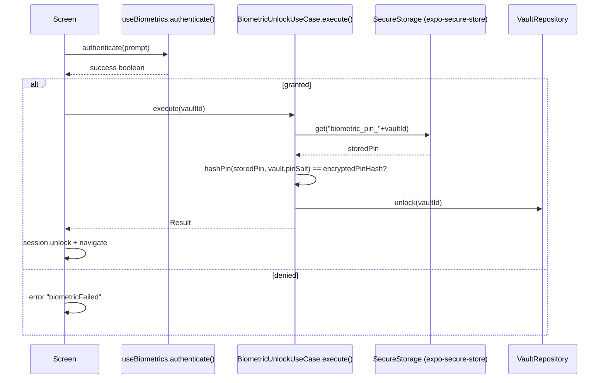

## 6. Security Notes

1. **Plaintext PIN at rest**: `storeBiometricPin` stores the PIN itself (not an encryption token). Compromise of SecureStore (device-rooted) exposes the PIN.
2. **No biometric-only gating in the use case**: `BiometricUnlockUseCase.execute` does not itself require a fresh biometric success — the UI layer calls `authenticate()` first. A caller could invoke `execute()` without a biometric check.
3. **`biometric_enabled` flag** (`biometric-setup.tsx:13`, `settings.tsx:81`) is informational; login screen shows the biometric button whenever `isAvailable` regardless of this flag (`login.tsx:167`).
4. **Consistency gap**: `biometric-setup.tsx` is unreachable from the flow (no caller found — dead route). Biometric PIN is still stored at vault creation, so the biometric button appears on login regardless.
5. Lockout (5 attempts / 5 min) applies only to **PIN** path; biometric path bypasses failed-attempt tracking.
# 06 — Security Audit

Documented from source. Findings are descriptive (no fixes applied per OSS rules).

## 1. Security Layers

| Layer | Mechanism | Evidence |
|---|---|---|
| PIN hashing | Iterative SHA-256 ×100k | `secure.ts:48-57` |
| Data encryption | SHA-256 stream construction (IV+tag+ciphertext hex) | `crypto.ts:30-72` |
| Key storage | expo-secure-store (Android Keystore/Keychain) | `SecureStorageSource.ts:8-10` |
| DB encryption | `PRAGMA key` attempted with `db_encryption_key` in SecureStore; **falls back silently** | `DatabaseService.ts:20-35` |
| Screen capture | `preventScreenCaptureAsync()` | `app/_layout.tsx:76` |
| Root/jailbreak | `rootDetectionEnabled` setting default **false**, no runtime code | `SettingsRepositoryImpl.ts:15` |
| Clipboard protection | `clipboard_protection` setting; **flag only, no clear logic found** | `settings.tsx:84-88`, `config.ts:28` |
| Auto-lock | AppState-based; default 5 min | `SessionProvider.tsx:21-22,76-97` |
| Permission blocking | RECORD_AUDIO, SYSTEM_ALERT_WINDOW, CAMERA blocked | `app.json` |
| Biometric | expo-local-authentication | `useBiometrics.ts` |

## 2. Configured vs Implemented Gaps

| Config constant | Value | Actually used? |
|---|---|---|
| `pbkdf2Iterations: 10000` | config.ts:18 | **No** — hashPin uses hardcoded 100000 iterations |
| `algorithm: 'aes-256-gcm'` | config.ts:23 | **Misleading** — real impl is SHA-256 stream cipher (see 07) |
| `maxLoginAttempts: 5` | config.ts:24 | Yes — duplicated in UnlockVaultUseCase (`:5`) |
| `lockoutDurationMs: 5min` | config.ts:25 | Yes — duplicated (`UnlockVaultUseCase:6`) |
| `autoLockSeconds: 60` | config.ts:26 | **No** — SessionProvider default is 300000ms |
| `sessionTimeoutMs: 15min` | config.ts:27 | **No** — never referenced |
| `clipboardClearMs: 10000` | config.ts:28 | **No** — no clipboard-clear implementation |
| `rootDetectionEnabled` | SettingsRepositoryImpl:15 | **No runtime code** |
| `secureDeleteEnabled` | SettingsRepositoryImpl:16 | **No** — deletes are plain `File.delete` |
| `autoBackupEnabled` / `intervalDays` | SettingsRepositoryImpl:20-21 | **No** — no scheduler |

## 3. File Storage Encryption Status

| Storage path | Encrypted? | Evidence |
|---|---|---|
| `items.encrypted_data`/`encrypted_path` | Decrypted data only if stored via encrypted flow | `ItemRepositoryImpl` stores raw DTO without encryption |
| `Files` tab import (`khaznati/{vaultId}/*`) | **NO — raw copy** | `files.tsx:22-31` (`copyImportedFile`) |
| Media gallery (`.encrypted_media/*.enc`) | **YES** — `encryptFile()` | `media.tsx:116`, `MediaStorage.ts` |
| Notes content | **YES** — `encryptData()` | `NoteRepositoryImpl.ts:31,71` |
| Password values | **YES** — `encryptData()` | `PasswordRepositoryImpl.ts:31,89` |
| SQLite DB | Partial — PRAGMA key, but silent fallback if unsupported | `DatabaseService.ts:31-35` |

## 4. Authentication Controls

- Brute-force: 5 failed attempts → 5-minute lockout (`UnlockVaultUseCase.ts:5-6,21-33,38-46`).
- Timing: no constant-time comparison; JS string compare (`:37`).
- Biometric path bypasses attempt counter (`05-Biometric-Authentication.md` §6.5).
- Remember-me stores a marker only; no secure token (`login.tsx:19,44-50`).

## 5. Secrets / Keys Inventory (SecureStore keys)

| Key | Source | Value |
|---|---|---|
| `db_encryption_key` | DatabaseService.ts:22-28 | 32-byte hex key |
| `biometric_pin_{vaultId}` | BiometricUnlockUseCase.ts:7,38 | **plaintext PIN** |
| `note_vault_key_{vaultId}` | NoteRepositoryImpl.ts:19 | 32-byte hex |
| `pwd_vault_key_{vaultId}` | PasswordRepositoryImpl.ts:19 | 32-byte hex |
| `media_vault_key_{vaultId}` | MediaStorage.ts:11 | 32-byte hex |
| `biometric_enabled` | biometric-setup.tsx:13 | `'true'` |
| `auto_lock_timeout` | SessionProvider.tsx:21 | ms number |
| `clipboard_protection` | settings.tsx:87 | boolean string |
| `khaznati_remember_vault_{vaultId}` | login.tsx:19 | `'true'` |

## 6. Risk Summary (Highest First)

1. **Files tab imports plaintext** (`files.tsx:22-31`) — sensitive files stored unencrypted on device. Contradicts product promise ("كل شيء مشفر").
2. **DB encryption silent fallback** (`DatabaseService.ts:31-35`) — on platforms without SQLCipher the app proceeds unencrypted without warning.
3. **Non-standard cipher** (custom SHA-256 stream + tag) — see `07-Encryption-Implementation.md`.
4. **Plaintext PIN in SecureStore** for biometric unlock.
5. **Dead settings** imply advertised protections (root detection, secure delete, clipboard clear) don't exist.
6. **`Math.random` password generator** (`passwords.tsx:67`) — not CSPRNG.
7. **Backup/restore copies raw DB file** — includes PIN hashes and encrypted rows; no integrity checksum enforcement on restore (`settings.tsx:126-193`, `DatabaseService.ts:148-159`).
# 07 — Encryption Implementation

Detailed analysis of `src/core/utils/crypto.ts` (249 lines) — the only crypto module.

## 1. Overview

Despite `APP_CONFIG.security.algorithm = 'aes-256-gcm'`, the implementation is a **custom symmetric stream cipher built on SHA-256**:

- **Key**: 32 random bytes (hex-encoded) — `generateEncryptionKey()` (`:20-23`).
- **IV**: 12 random bytes per message (`:32`).
- **Keystream**: counter-mode SHA-256 over `key ‖ iv ‖ counter` producing 32-byte blocks (`:35-53`).
- **Encryption**: `ciphertext[i] = plaintext[i] XOR keystream[i]` (`:55-58`).
- **Authentication tag**: first 16 bytes of `SHA256(iv_hex + ciphertext_hex + key_hex)` (`:60-65`).
- **Output layout (hex)**: `[IV 12][TAG 16][ciphertext]` (`:67-71`).

## 2. Encrypt Flow (`encryptData`, `:30-72`)

```mermaid
graph TD
  A[keyHex 32B] --> B[hexToBytes]
  C[plaintext] --> D[TextEncoder → bytes]
  E[getRandomBytes 12B] --> F[IV]
  F --> G{loop i step 32}
  G --> H[counter = i/32 big-endian 4B]
  H --> I[combined = key ‖ IV ‖ counter]
  I --> J[SHA256(combined) → 32B block]
  J --> K[keystream[i..i+32] = block]
  K --> G
  L[keystream] --> M[XOR → ciphertext]
  M --> N[tag = SHA256(ivHex+cipherHex+keyHex) first 16B]
  N --> O[output hex = IV ‖ TAG ‖ ciphertext]
```

## 3. Decrypt Flow (`decryptData`, `:74-131`)

1. Parse `[IV][TAG][ciphertext]` (`:83-85`).
2. Recompute expected tag, constant-ish loop compare (`:87-100`) — fails → returns `'[encrypted]'` (swallows tamper error).
3. Regenerate keystream, XOR back, `TextDecoder` (`:102-127`).
4. Any error → `'[encrypted]'` placeholder (`:128-130`).

## 4. File Variants

| Function | Input | Output | Notes |
|---|---|---|---|
| `encryptData` | UTF-8 string | hex string | DB fields (`:30`) |
| `decryptData` | hex string | string | `'[encrypted]'` on failure |
| `encryptObject/decryptObject` | object → JSON | hex string | `:133-140` |
| `encryptFile` | **base64** string | **base64** string | media, `:142-184` |
| `decryptFile` | base64 string | base64 string | `''` on failure, `:186-236` |

## 5. Key Management

- Keys generated via `Crypto.getRandomBytesAsync(32)` (`:20-23`); hex strings.
- Per-vault keys stored in SecureStore: `note_vault_key_*`, `pwd_vault_key_*`, `media_vault_key_*` (see `06` §5).
- One DB key `db_encryption_key` for SQLite PRAGMA (`DatabaseService.ts:22-28`).

## 6. Correctness / Security Analysis

| Aspect | Assessment |
|---|---|
| Keystream uniqueness | IV 12B random per message — good |
| XOR stream | Correct counter-mode construction (no reuse with same IV+key) |
| Key length | 32B (256-bit) — good |
| Authentication | SHA-256 truncation to 16B tag — **not standard GCM; timing not constant-time** |
| Authenticated encryption | Encrypt-then-MAC layout; tag computed over `iv+cipher`+key — ok-ish |
| KDF | Iterated SHA-256 (not PBKDF2/HMAC); iteration count hardcoded 100k |
| Tamper detection | `decryptData` returns `'[encrypted]'` rather than throwing → silent data loss in UI |
| At-rest file coverage | Files tab does **not** use crypto at all (raw copy, `files.tsx:22-31`) |
| Standard-compliance | **Not AES-GCM.** Any doc/label claiming AES-256-GCM is inaccurate |

## 7. Constants (module-level)

`IV_LENGTH=12`, `KEY_LENGTH=32`, `SALT_LENGTH=16`, `TAG_LENGTH=16` (`:3-6`). `generateSalt()` here (16B) differs from `secure.ts` salt (also 16B) — both used: crypto for keys, secure for PIN salt.
# 08 — Database Schema

## 1. Engine & Connection (`DatabaseService.ts`)

- `expo-sqlite` sync API: `openDatabaseSync('khaznati.db')` (`:17`).
- PRAGMAs (`:31-41`): optional `key` (encryption, silent fallback), `journal_mode=WAL`, `synchronous=NORMAL`, `cache_size=-4000`, `temp_store=MEMORY`, `foreign_keys=ON`.
- Query helpers: `executeSql`, `query`, `queryOne`, `transaction` (BEGIN/COMMIT/ROLLBACK), `close`, `backup`, `restore`, `getVersion/setVersion`, `integrityCheck` (`:53-164`).
- `withRetry` wraps all DB calls (`:56-85`).

## 2. Tables (from `SCHEMA`, `src/data/database/schema.ts`)

### vaults (`:3-20`)
| Column | Type | Notes |
|---|---|---|
| id | TEXT PK | UUID |
| name | TEXT | |
| type | TEXT | default 'personal' |
| icon | TEXT | default 'shield-lock' |
| color | TEXT | default '#6C63FF' |
| created_at / updated_at | INTEGER | ms epoch |
| last_accessed_at | INTEGER NULL | |
| is_locked | INTEGER | default 1 |
| encrypted_pin_hash | TEXT | |
| pin_salt | TEXT | |
| failed_attempts | INTEGER | default 0 |
| locked_until | INTEGER NULL | |
| item_count | INTEGER | default 0 |
| total_size | INTEGER | default 0 |
| backup_version | INTEGER | default 0 |

### items (`:22-40`)
| Column | Type | Notes |
|---|---|---|
| id | TEXT PK | |
| vault_id | TEXT FK→vaults(id) CASCADE | |
| parent_id | TEXT NULL | folder hierarchy |
| name | TEXT | |
| type | TEXT | folder/image/video/audio/document/file/note/password |
| mime_type | TEXT NULL | |
| size | INTEGER | default 0 |
| encrypted_path | TEXT NULL | file URI |
| encrypted_data | TEXT NULL | |
| thumbnail_path | TEXT NULL | |
| metadata_json | TEXT NULL | |
| is_favorite / is_deleted | INTEGER | default 0 |
| created_at / updated_at / deleted_at | INTEGER | |

### notes (`:42-53`)
id, vault_id FK CASCADE, title TEXT (default ''), encrypted_content TEXT, is_encrypted (default 1), color TEXT NULL, is_pinned (default 0), created_at, updated_at.

### passwords (`:55-69`)
id, vault_id FK CASCADE, service_name, service_url NULL, username NULL, encrypted_password, category NULL, notes NULL, strength_score (default 0), created_at, updated_at, last_used_at NULL.

### activity_log (`:71-80`)
id PK, vault_id FK CASCADE NULL, action TEXT, target_type NULL, target_id NULL, metadata_json NULL, created_at.

### settings (`:82-86`)
key TEXT PK, value TEXT, updated_at.

### backup_metadata (`:88-95`)
id PK, version, created_at, file_size NULL, checksum NULL, is_encrypted (default 1).

### Indexes (in `SCHEMA`, `:97-107`)
`idx_items_vault_id`, `idx_items_parent_id`, `idx_items_type`, `idx_items_deleted`, `idx_items_favorite`, `idx_notes_vault_id`, `idx_notes_pinned`, `idx_passwords_vault_id`, `idx_passwords_category`, `idx_activity_log_created`, `idx_activity_log_action`.

## 3. Entity-Relationship (Mermaid)

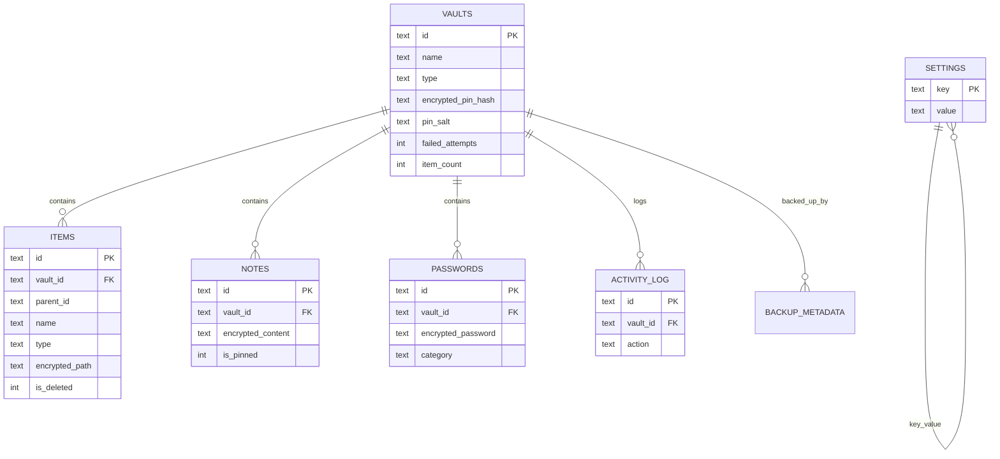

## 4. Migration Table (runtime)

`_migrations(version PK, name, applied_at)` created by `MigrationRunner.run` (`MigrationRunner.ts:22-28`). Effective current version = max(PRAGMA user_version, max(_migrations)).

## 5. Data Notes

- **Foreign keys** rely on `PRAGMA foreign_keys=ON` (`DatabaseService.ts:41`) for CASCADE deletes of vault children.
- `vault_id` in `activity_log` is inserted as `undefined` (`ActivityLogRepositoryImpl.ts:30`) → stored as NULL.
- `backup_metadata` table exists but is **never written** by any code (dead table).
- Items keep both `encrypted_path` (URI) and `encrypted_data` (payload) columns; current flows write only `encrypted_path`.
# 09 — Migrations History

## 1. Migration Infrastructure

- Runner: `src/data/database/MigrationRunner.ts` — `register()`, `run(db, targetVersion?)`, `getStatus(db)`.
- Registration: `src/core/di/register.ts:25-30` — `createMigrationRunner()` registers both migrations.
- Executed at boot: `app/_layout.tsx:72-73`.
- Version tracking: `_migrations` table + `PRAGMA user_version` (max wins, `MigrationRunner.ts:31-34`).
- Both up and down supported (down used when target < current).

## 2. Migration Log

| Version | Name | Up | Down | Evidence |
|---|---|---|---|---|
| 1 | initial | Creates all 7 tables + 11 indexes via `SCHEMA` | Drops tables in reverse order (backup_metadata → vaults) | `001_initial.ts:5-17` |
| 2 | indexes | Adds 7 performance indexes | Drops those indexes | `002_indexes.ts:4-22` |

## 3. Indexes Per Version

| Version | Indexes |
|---|---|
| 1 (`schema.ts:97-107`) | items: vault_id, parent_id, type, deleted, favorite; notes: vault_id, pinned; passwords: vault_id, category; activity_log: created, action |
| 2 (`002_indexes.ts:5-11`) | items: vault_id, parent_id, updated_at, type; vaults: updated_at; activity_log: vault_id, created_at |

> Note: `idx_items_vault_id`, `idx_items_parent_id`, `idx_items_type`, `idx_activity_log_created` are created by **both** migrations (idempotent `IF NOT EXISTS`).

## 4. Migration Flow (Mermaid)

```mermaid
graph TD
  A[Boot: app/_layout.tsx] --> B[resolve MigrationRunner]
  B --> C[runner.run db]
  C --> D[ensure _migrations table]
  D --> E[version = max user_version, max(_migrations)]
  E --> F{current < target?}
  F -->|yes| G[for each migration v>current && v<=target]
  G --> H[migration.up db]
  H --> I[INSERT _migrations]
  I --> J[set user_version]
  F -->|no, current > target| K[reverse: migration.down]
  K --> L[DELETE _migrations row]
  L --> M[set user_version - 1]
```

## 5. Status API

`getStatus(db)` returns `{ version, migrations: [{version,name,applied}] }` (`MigrationRunner.ts:63-76`) — supports a future diagnostics UI; currently unused by screens.

## 6. Observations

- Version 2 partially duplicates version 1 indexes (harmless due to `IF NOT EXISTS`).
- No migration for `backup_metadata` writes; table unused.
- Down path exists but no rollback UI; a manual revert would require `runner.run(db, target)`.
# 10 — Data Repositories

Six repository implementations in `src/data/repositories/`, each implementing a `src/domain/repositories/*` interface. All return `Result<T>` and map via DTO/mapper pairs.

## 10.1 VaultRepositoryImpl (`VaultRepositoryImpl.ts`)

Constructor: `(db: DatabaseService)` (`:12`).
| Method | SQL / Behavior | Line |
|---|---|---|
| `create(vault)` | INSERT all 16 columns | `:15-30` |
| `findById` | SELECT by id | `:35-42` |
| `findAll` | ORDER BY created_at DESC | `:45-52` |
| `update` | UPDATE name/type/icon/color/... | `:55-69` |
| `delete` | DELETE by id | `:72-79` |
| `updateLastAccessed` | now() | `:82-92` |
| `lock` | is_locked=1 | `:95-102` |
| `unlock` | is_locked=0 + last_accessed_at | `:105-115` |
| `updateFields` | partial failed_attempts/locked_until | `:118-143` |
| `count` | COUNT(*) | `:146-153` |

## 10.2 ItemRepositoryImpl (`ItemRepositoryImpl.ts`)

Constructor: `(db: DatabaseService)` (`:13`).
| Method | Behavior | Line |
|---|---|---|
| `create` | INSERT + `updateVaultCounts` | `:16-34` |
| `findById` | by id | `:37-44` |
| `findByVaultId` | filters (type/sort/limit/offset) | `:47-78` |
| `findByParentId` | folder children | `:81-98` |
| `update` | full update | `:101-117` |
| `delete` | hard delete in transaction + recount | `:120-134` |
| `softDelete` | is_deleted=1 + deleted_at | `:137-147` |
| `restore` | is_deleted=0 | `:150-160` |
| `move` | parent_id change | `:163-173` |
| `toggleFavorite` | toggle flag | `:176-186` |
| `search` | name LIKE | `:189-199` |
| `countByVaultId` / `getTotalSize` | aggregates | `:202-225` |
| `getRecentItems(limit)` | newest first | `:228-238` |
| private `updateVaultCounts` | updates vaults.item_count/total_size | `:240-249` |

**Security note**: items pass through unencrypted (no crypto in this repository) — encryption responsibility sits with callers/media flow.

## 10.3 NoteRepositoryImpl (`NoteRepositoryImpl.ts`)

Constructor: `(db, secureStorage)` (`:13-16`). Encrypts content with per-vault key `note_vault_key_{vaultId}` (`:18-26`).
| Method | Behavior | Line |
|---|---|---|
| `create` | encrypt + INSERT | `:28-43` |
| `findById` | decrypt via `decryptNote` | `:45-53` |
| `findByVaultId` | ORDER pinned DESC, updated DESC, decrypt all | `:55-66` |
| `update` | encrypt + UPDATE | `:68-83` |
| `delete` | DELETE | `:85-92` |
| `togglePin` | toggle flag SQL | `:94-104` |
| `search` | title LIKE, decrypt | `:106-117` |
| private `decryptNote` | decrypt or `'[encrypted]'` | `:119-129` |

## 10.4 PasswordRepositoryImpl (`PasswordRepositoryImpl.ts`)

Constructor: `(db, secureStorage)` (`:13-16`). Key `pwd_vault_key_{vaultId}` (`:18-26`).
| Method | Behavior | Line |
|---|---|---|
| `create` | encrypt + INSERT | `:28-45` |
| `findById` | decrypt or `'[encrypted]'` | `:47-62` |
| `findByVaultId` | ORDER service_name ASC, decrypt all | `:64-84` |
| `update` | encrypt + UPDATE | `:86-101` |
| `delete` | DELETE | `:103-110` |
| `search` | LIKE on name/username/category | `:112-124` |
| `updateLastUsed` | now() | `:126-136` |

## 10.5 ActivityLogRepositoryImpl (`ActivityLogRepositoryImpl.ts`)

Constructor: `(db)` (`:14`).
| Method | Behavior | Line |
|---|---|---|
| `log(action,targetType,targetId,metadata)` | INSERT (vault_id **undefined** → NULL) | `:17-41` |
| `findAll(options)` | filter by actions, limit/offset | `:44-70` |
| `findByAction` | WHERE action = ? | `:73-83` |
| `getRecent(limit)` | newest first LIMIT | `:86-96` |
| `clear` | DELETE all | `:99-106` |
| `count` | COUNT(*) | `:109-116` |

**Key finding**: `.log()` is never invoked by any screen — table remains empty in normal operation (see `14`).

## 10.6 SettingsRepositoryImpl (`SettingsRepositoryImpl.ts`)

Constructor: `(db)` (`:25`).
- `DEFAULT_SETTINGS` (17 keys) defined `:7-22`.
- `get()` — loads all, coalesces defaults (`:29-56`).
- `update(partial)` — merge + `INSERT OR REPLACE` in transaction (`:59-83`).
- `getValue/setValue` — single key ops (`:86-109`).
- `getDefaults()` — clone (`:112-114`).
- **Unused**: registered in DI (`register.ts:67-69`) but never resolved by any screen.

## 10.7 DI Wiring (`register.ts`)

| Token | Implementation | Dependencies | Line |
|---|---|---|---|
| `DatabaseService` | — | — | `:35` |
| `SecureStorageSource` | — | — | `:36` |
| `FileSystemSource` | — | SecureStorageSource | `:37-39` |
| `MigrationRunner` | — | — | `:43` |
| `VaultRepository` | VaultRepositoryImpl | db | `:46-48` |
| `ItemRepository` | ItemRepositoryImpl | db | `:49-51` |
| `NoteRepository` | NoteRepositoryImpl | db, secure | `:52-57` |
| `PasswordRepository` | PasswordRepositoryImpl | db, secure | `:58-63` |
| `ActivityLogRepository` | ActivityLogRepositoryImpl | db | `:64-66` |
| `SettingsRepository` | SettingsRepositoryImpl | db | `:67-69` |
# 11 — Use Cases Registry

All use cases live in `src/domain/usecases/`. They implement the business rules and return `Result<T>`.

## 11.1 Vault Use Cases

### CreateVaultUseCase (`vault/CreateVaultUseCase.ts`)
- **Input**: `CreateVaultInput { name, type, pin, icon?, color? }` (`:9-15`).
- **Validates**: name + PIN via `validateVaultName`/`validatePin` (`:24-32`).
- **Creates**: salt, hashPin, Vault entity (defaults icon/color) (`:34-55`).
- **Side effect**: `biometricUnlockUseCase.storeBiometricPin(vault.id, pin)` on success (`:58-60`).
- **Consumed by**: `useVaults.createVault` → create-vault.tsx (`useVaults.ts:33-39`).

### GetVaultsUseCase (`vault/GetVaultsUseCase.ts`)
- `execute()` → `vaultRepository.findAll()` (`:8-10`). Consumed by `useVaults` on mount.

### DeleteVaultUseCase (`vault/DeleteVaultUseCase.ts`)
- `execute(id)` → `vaultRepository.delete(id)` (`:7-9`). Consumed by settings clear-all via `useVaults`.

### LockVaultUseCase (`vault/LockVaultUseCase.ts`)
- `execute(id)` → `lock(id)` (`:7-9`). Consumed by settings lock-all.

### UnlockVaultUseCase (`vault/UnlockVaultUseCase.ts`)
- **Logic**: lockout (5/5min), hashPin compare, counters, unlock — full detail in `04-Authentication-Flow.md` §4.
- **Consumed by**: `useVaults.unlockVault` → login.tsx.

## 11.2 Item Use Cases

### AddItemUseCase (`item/AddItemUseCase.ts`)
- **Input**: `AddItemInput` (`:7-17`).
- Validates name non-empty (`:23-25`), builds Item, `create()` (`:27-47`).
- **Consumed by**: none (registered in DI but screens use `ItemRepository` directly — see `14`).

### DeleteItemUseCase (`item/DeleteItemUseCase.ts`)
- `execute(id, permanent=false)` → `delete()` if permanent else `softDelete()` (`:7-12`).
- **Consumed by**: none directly (dead registration).

### SearchItemsUseCase (`item/SearchItemsUseCase.ts`)
- `execute(vaultId, query)` → search or full list if empty (`:8-13`).
- **Consumed by**: none directly.

## 11.3 Auth Use Case

### BiometricUnlockUseCase (`auth/BiometricUnlockUseCase.ts`)
- `execute(vaultId)` / `storeBiometricPin` / `hasBiometricPin` / `removeBiometricPin` (`:14-53`).
- **Consumed by**: login.tsx (`:78`), create-vault.tsx (`:67`).

## 11.4 Usage Graph (Mermaid)

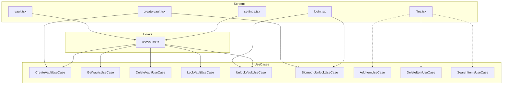

> Dashed links (`AddItem/DeleteItem/SearchItems`) represent **registered but not resolved** use cases — screens call repository methods directly (e.g. `files.tsx:45-48,98`).
# 12 — Dependency Injection

## 1. Container (`src/core/di/container.ts`)

Custom Service Locator with:
- `registerSingleton(key, factory)` — caches one instance.
- `registerTransient(key, factory)` — new instance per resolve.
- `resolve<T>(key)` — get instance.
- Circular-dependency detection in resolve (reported by earlier survey; verified registration is top-down).
- Keys are plain strings (not symbols).

## 2. Registration Catalogue (`src/core/di/register.ts`)

All registrations are **singletons** (`:35-104`):

| Token | Factory creates | Constructor deps | Line |
|---|---|---|---|
| `DatabaseService` | DatabaseService | — | `:35` |
| `SecureStorageSource` | SecureStorageSource | — | `:36` |
| `FileSystemSource` | FileSystemSource | SecureStorageSource | `:37-39` |
| `MigrationRunner` | MigrationRunner | (pre-registered migrations) | `:43` |
| `VaultRepository` | VaultRepositoryImpl | db | `:46-48` |
| `ItemRepository` | ItemRepositoryImpl | db | `:49-51` |
| `NoteRepository` | NoteRepositoryImpl | db, secure | `:52-57` |
| `PasswordRepository` | PasswordRepositoryImpl | db, secure | `:58-63` |
| `ActivityLogRepository` | ActivityLogRepositoryImpl | db | `:64-66` |
| `SettingsRepository` | SettingsRepositoryImpl | db | `:67-69` |
| `CreateVaultUseCase` | CreateVaultUseCase | VaultRepository, BiometricUnlockUseCase | `:72-77` |
| `GetVaultsUseCase` | GetVaultsUseCase | VaultRepository | `:78-80` |
| `DeleteVaultUseCase` | DeleteVaultUseCase | VaultRepository | `:81-83` |
| `LockVaultUseCase` | LockVaultUseCase | VaultRepository | `:84-86` |
| `UnlockVaultUseCase` | UnlockVaultUseCase | VaultRepository | `:87-89` |
| `AddItemUseCase` | AddItemUseCase | ItemRepository | `:90-92` |
| `DeleteItemUseCase` | DeleteItemUseCase | ItemRepository | `:93-95` |
| `SearchItemsUseCase` | SearchItemsUseCase | ItemRepository | `:96-98` |
| `BiometricUnlockUseCase` | BiometricUnlockUseCase | VaultRepository, SecureStorageSource | `:99-104` |

> `CreateVaultUseCase` depends on `BiometricUnlockUseCase`, which is registered *after* — order is safe because factories resolve lazily at first `resolve()`, and `registerDependencies()` completes before any `resolve` runs at boot (`app/_layout.tsx:69`).

## 3. Consumers (resolve sites)

| Resolved token | Consumer | File:Line |
|---|---|---|
| `DatabaseService` | app/_layout | `app/_layout.tsx:70` |
| `MigrationRunner` | app/_layout | `app/_layout.tsx:72` |
| `SecureStorageSource` | SessionProvider | `SessionProvider.tsx:38` |
| `GetVaults/CreateVault/Delete/Lock/UnlockVaultUseCase` | useVaults hook | `useVaults.ts:15-19` |
| `BiometricUnlockUseCase` | login, create-vault | `login.tsx:78`, `create-vault.tsx:67` |
| `ItemRepository` | files | `files.tsx:46` |
| `NoteRepository` | notes | `notes.tsx:38` |
| `PasswordRepository` | passwords | `passwords.tsx:46` |
| `ActivityLogRepository` | activity-log modal | `activity-log.tsx:41,57` |

## 4. Dependency Graph (Mermaid)

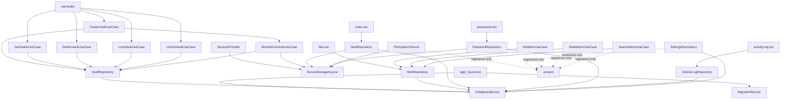

## 5. Observations

1. DI container holds 19 singletons; 3 repositories (FileSystemSource, SettingsRepository) and 3 item use cases are **never resolved** (dead registrations — see `14`).
2. The container is module-level global; hooks resolve inside render bodies (`useVaults.ts:15-19`) without `useMemo` on the container itself — fine since singletons.
3. No testability seams (no injection of mocks via container in app runtime); unit tests construct classes directly.
# 13 — Dependency & Call Graph

Cross-cutting call graph: screen → hook/component → use case → repository → database/core.

## 1. Full Call Graph (Mermaid)

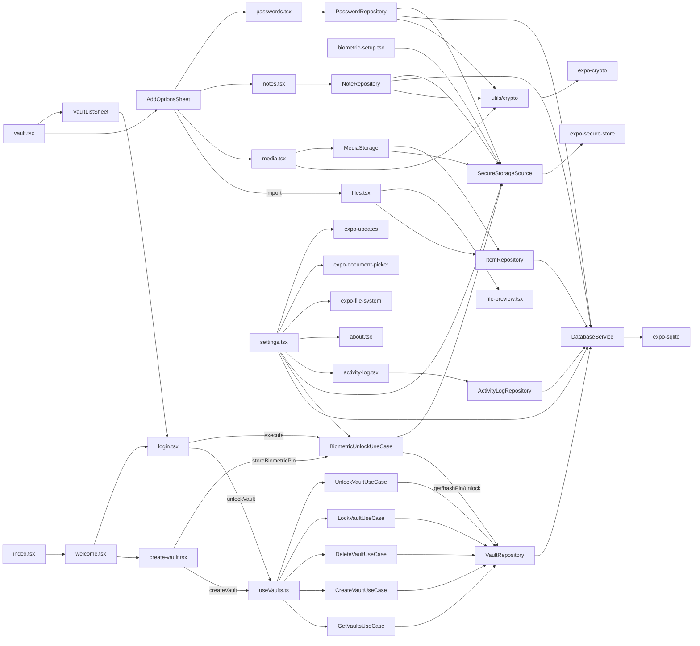

## 2. Layer Boundaries

| Direction | Allowed | Evidence |
|---|---|---|
| app → ui/domain/data/core | yes | screens import components + DI tokens |
| ui → domain | yes | hooks call use cases |
| ui → data | yes | activity-log resolves `ActivityLogRepositoryImpl` directly (`activity-log.tsx:11,41`) |
| domain → data | **no (by design)** | domain only knows interfaces; data implements them |
| data → core | yes | repositories import `@core/errors`, `@core/utils/crypto` |
| core → external libs | yes | crypto uses expo-crypto |

**Violation noted**: `ui/providers/SessionProvider.tsx:5` imports `SecureStorageSource` (data) directly; `media.tsx` imports `MediaStorage` (data) and `encryptFile/decryptFile` (core) directly; screens import DTO/repository impls. Pragmatic shortcuts that skip interface indirection.

## 3. Module Import Hotspots (frequently imported)

| Module | Imported by |
|---|---|
| `@core/utils` (index) | ~everywhere (id, time, logger, resilience, secure) |
| `@core/theme` | all UI + screens (spacing/colors/typography) |
| `@core/errors` | all domain + data |
| `@core/di/container` | all hooks + screens using DI |
| `@ui/providers/ThemeProvider` | all UI + screens |
| `react-i18next` `useTranslation` | all screens |

## 4. Circular Dependency Risk Assessment

- `CreateVaultUseCase → BiometricUnlockUseCase → VaultRepository` (no cycle).
- `useVaults` resolves 5 use cases each render — cheap (singletons) but not memoized list.
- Container resolves lazily; boot order (register → resolve) avoids cycles (`app/_layout.tsx:69-73`).

## 5. Dead Ends (resolve/import to nowhere)

- `FileSystemSource`, `SettingsRepository`, `AddItemUseCase`, `DeleteItemUseCase`, `SearchItemsUseCase` — registered only.
- Components `BottomSheet`, `Dialog`, `GlassCard`, `Snackbar`, `Skeleton`, `VaultCard`, `ItemRow`; hooks `useDebounce`, `useAppState` — exported but unused (see `14`).
# 14 — Hidden Features & Dead Code

Survey of unused code paths, dead registrations, unreachable routes, and config constants that imply features that don't exist in code. **No fixes applied** (OSS rules).

## 14.1 Unused Components (built but never imported)

Verified via project-wide grep (`grep -rn <Name> app src` excluding the component file itself):

| Component | File | Usage count outside itself |
|---|---|---|
| `BottomSheet` | `src/ui/components/molecules/BottomSheet.tsx` | 0 |
| `Dialog` | `src/ui/components/molecules/Dialog.tsx` | 0 |
| `GlassCard` | `src/ui/components/molecules/GlassCard.tsx` | 0 |
| `Snackbar` | `src/ui/components/atoms/Snackbar.tsx` | 0 |
| `Skeleton` | `src/ui/components/atoms/Skeleton.tsx` | 0 |
| `VaultCard` | `src/ui/components/organisms/VaultCard.tsx` | 0 |
| `ItemRow` | `src/ui/components/organisms/ItemRow.tsx` | 0 |

All re-exported through `components/{atoms,molecules,organisms}/index.ts` and `components/index.ts` — public API surface larger than used.

## 14.2 Unused Hooks

| Hook | File | Usage |
|---|---|---|
| `useAppState` | `src/ui/hooks/useAppState.ts` | exported via `hooks/index.ts` only |
| `useDebounce` | `src/ui/hooks/useDebounce.ts` | exported only |
| `useResponsive` | `src/ui/hooks/useResponsive.ts` | used only in `welcome.tsx:8,16` |

> Note: `SessionProvider` implements its own AppState listener instead of using `useAppState` (`SessionProvider.tsx:76-97`) — duplicated logic.

## 14.3 Dead DI Registrations

Registered singletons never resolved by any screen/hook:

| Token | Registration line |
|---|---|
| `FileSystemSource` | `register.ts:37-39` |
| `SettingsRepository` | `register.ts:67-69` |
| `AddItemUseCase` | `register.ts:90-92` |
| `DeleteItemUseCase` | `register.ts:93-95` |
| `SearchItemsUseCase` | `register.ts:96-98` |

Screens bypass use-cases and call repository methods directly (`files.tsx:46,98`, `notes.tsx:38,84`, `passwords.tsx:46,84`).

## 14.4 Unreachable / Dead Routes

| Screen | Evidence |
|---|---|
| `biometric-setup.tsx` | Registered in auth stack (`app/(auth)/_layout.tsx:19`) but **no `router.push/replace` target anywhere** — unreachable. Flow always goes create-vault → vault directly. |
| `create-folder.tsx` | Registered (`modals/_layout.tsx:18`); no push target found (folder creation not wired from FilesList UI). |

## 14.5 Config Constants / Settings With No Implementation

| Constant | Where defined | Runtime usage |
|---|---|---|
| `security.pbkdf2Iterations` | config.ts:18 | none (hashPin hardcodes 100000) |
| `security.algorithm: 'aes-256-gcm'` | config.ts:23 | misleading (see 07) |
| `security.autoLockSeconds: 60` | config.ts:26 | none (SessionProvider default 300000) |
| `security.sessionTimeoutMs: 15min` | config.ts:27 | none |
| `security.clipboardClearMs: 10000` | config.ts:28 | none (no clear logic) |
| `storage.thumbnailsMaxWidth` | config.ts:33 | none (no thumbnail generation) |
| `storage.maxFileSize` / `chunkSize` | config.ts:35-36 | none |
| `backup.magicHeader` / `currentVersion` | config.ts:42-43 | none (backup is raw DB copy) |
| `rootDetectionEnabled` (settings) | SettingsRepositoryImpl:15 | no root-detection code |
| `secureDeleteEnabled` (settings) | SettingsRepositoryImpl:16 | deletes use plain `File.delete` |
| `autoBackupEnabled` / `autoBackupIntervalDays` | SettingsRepositoryImpl:20-21 | no scheduler |
| `thumbnailQuality` / `storagePath` | SettingsRepositoryImpl:18-19 | unused |
| `AuthMethod.PASSWORD`, `PATTERN`, `LockType.*` variants | enums.ts | unused enum values |

## 14.6 Features That Appear Broken / Incomplete

| Feature | Evidence | Impact |
|---|---|---|
| **Activity log never populated** | No `.log()` call in app/src; modal reads empty table (`activity-log.tsx:41-45`) | Activity log always empty |
| **Files tab stores plaintext** | `copyImportedFile` raw copy (`files.tsx:22-31`); `ItemRepository.create` no encryption (`files.tsx:98-115`) | "Everything encrypted" claim false for files |
| **Biometric flag not enforced** | Login shows biometric button whenever `isAvailable` (`login.tsx:167`), ignores `biometric_enabled` | Toggle in settings has no effect on login |
| **Clipboard protection flag only** | `settings.tsx:84-88` stores boolean; no clipboard clearing logic | No actual protection |
| **Media export writes base64 text** | `tempFile.write(decryptedBase64)` writes the **base64 string** not binary (`media.tsx:158`) | Exported file may be corrupt/encoded |
| **backup_metadata never written** | table in schema; no writer | Backup versioning unavailable |
| **DB PRAGMA key silent fallback** | `DatabaseService.ts:31-35` | Unencrypted DB possible without warning |
| **`biometric_enabled` default false but PIN always stored** | create-vault stores PIN regardless (`create-vault.tsx:67-68`) | User can't "undo" stored PIN via UI |

## 14.7 Useful-but-Unused Public API

Ready-made infrastructure that could be wired up (informational):
- `ItemRepository` full CRUD incl. soft-delete/restore/move/favorite/search (10-Data-Repositories.md).
- `ActivityLogRepository.log` + action enum (20 actions defined in enums.ts:48-69).
- `MigrationRunner.getStatus`.
- `SettingsRepository` (persist settings per vault).
- `DatabaseService.backup/integrityCheck`.
# 15 — Critical Paths (Execution Flows)

## 15.1 App Boot

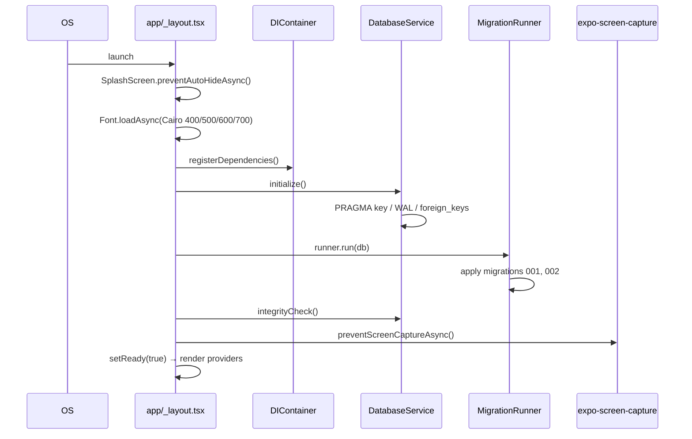

## 15.2 Vault Creation → First Screen

```mermaid
sequenceDiagram
  participant W as welcome.tsx
  participant C as create-vault.tsx
  participant V as useVaults
  participant CC as CreateVaultUseCase
  participant B as BiometricUnlockUseCase
  participant VR as VaultRepository
  participant SS as SecureStorage
  W->>C: router.push(create-vault)
  C->>C: gather name/icon/color/pin
  C->>V: createVault(input)
  V->>CC: execute(input)
  CC->>CC: validate name + pin
  CC->>CC: salt = generateSalt(); hash = hashPin(pin,salt)
  CC->>VR: create(vault)
  VR->>VR: INSERT INTO vaults
  CC->>B: storeBiometricPin(id, pin)
  B->>SS: set("biometric_pin_"+id, pin)
  C->>C: router.replace(vault tab)
```

## 15.3 PIN Login (with lockout)

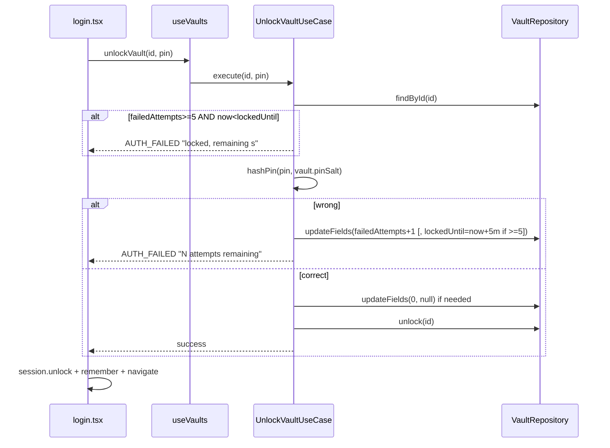

## 15.4 Auto-Lock on App Background

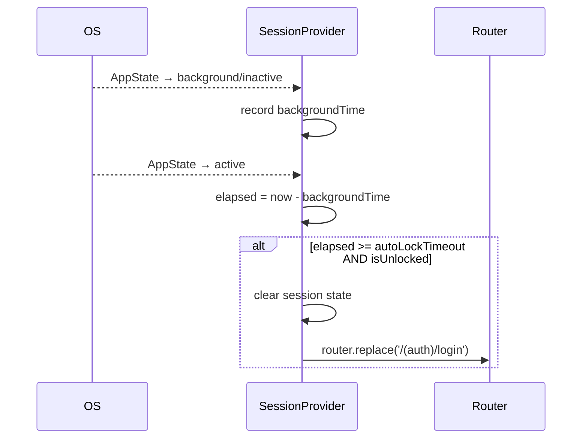

## 15.5 File Import (Files tab) — note: unencrypted

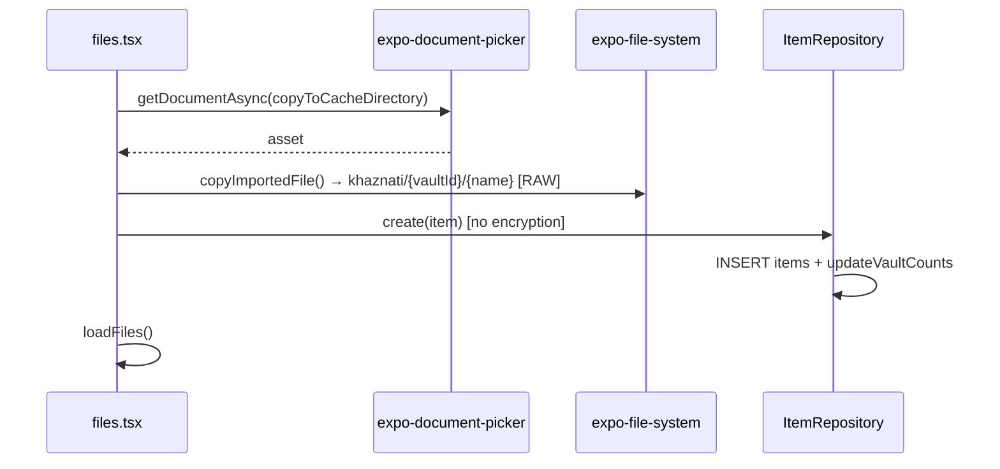

## 15.6 Media Import (encrypted)

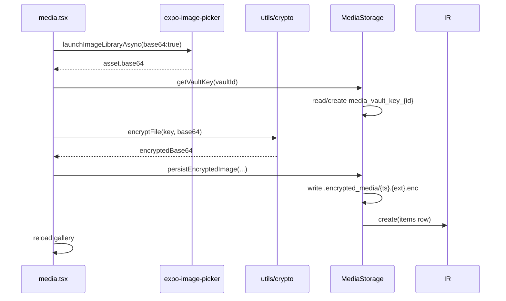

## 15.7 Backup & Restore

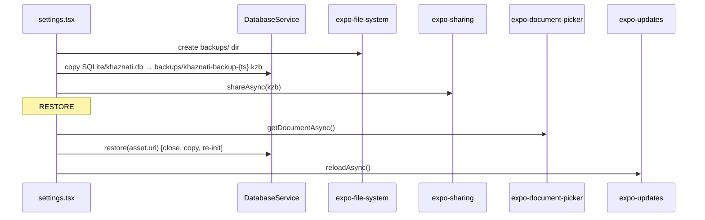

## 15.8 Clear All Data / Lock All

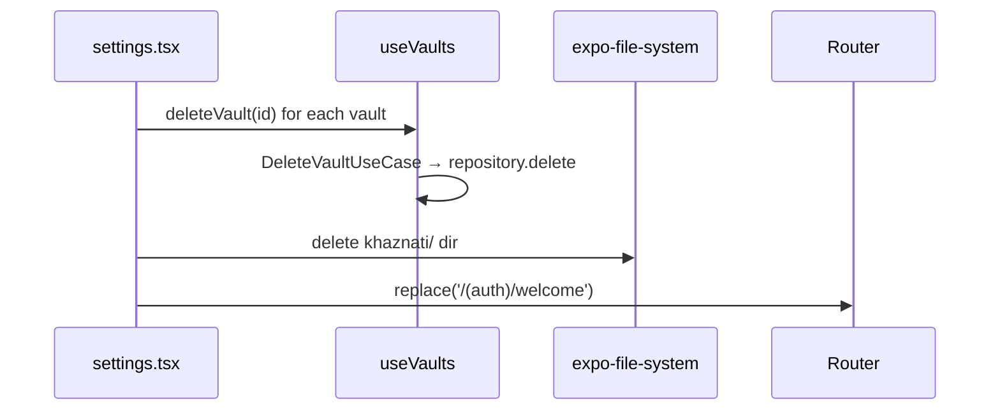
# 16 — Services Registry

Application services (runtime singletons + external SDK wrappers).

## 16.1 In-App Services (DI singletons)

| Service | Impl | Provides | Resolved by |
|---|---|---|---|
| DatabaseService | SQLite wrapper | open, PRAGMAs, query/execute/transaction, backup/restore, integrity | layout, all repositories |
| SecureStorageSource | expo-secure-store | set/get/delete/contains/isAvailable | repos, session, auth screens, settings |
| FileSystemSource | expo-file-system wrapper | file ops | **registered only (unused)** |
| MigrationRunner | migration engine | run/getStatus | layout |

## 16.2 External SDK Services (used directly)

| Service | Package | Usage sites |
|---|---|---|
| LocalAuthentication | expo-local-authentication | `useBiometrics.ts` (hasHardware/isEnrolled/getEnrolledLevel/authenticateAsync) |
| SecureStore | expo-secure-store | `SecureStorageSource.ts:8-31` |
| expo-crypto | crypto primitives | `crypto.ts`, `secure.ts` (getRandomBytes, digestStringAsync) |
| expo-sqlite | database | `DatabaseService.ts:1,17` |
| expo-file-system | paths/files | files/media/settings screens, MediaStorage |
| expo-document-picker | pick files | files.tsx, settings.tsx, AddOptionsSheet |
| expo-image-picker | pick images | media.tsx |
| expo-media-library | save to gallery + permission | media.tsx, files.tsx export |
| expo-sharing | share files | settings.tsx backup |
| expo-clipboard | copy text | passwords.tsx |
| expo-updates | OTA reload | settings.tsx language/restore |
| expo-screen-capture | block screenshots | app/_layout.tsx |
| expo-splash-screen | splash control | app/_layout.tsx |
| expo-font | Cairo font loading | app/_layout.tsx |
| expo-image | fast image rendering | file-preview.tsx |
| expo-linear-gradient | gradient hero | welcome.tsx |
| expo-constants / device / localization | device info / locale | i18n, misc |

## 16.3 Storage Location Map

| Service / Path | Used for | Encrypted? |
|---|---|---|
| SecureStore | keys, flags, remember, biometric pin | OS-level |
| `SQLite/khaznati.db` | all relational data | partial (PRAGMA key optional) |
| `document/khaznati/{vaultId}/*` | files tab | **no** |
| `document/khaznati/{vaultId}/.encrypted_media/*.enc` | media gallery | yes (crypto) |
| `document/backups/*.kzb` | backups | DB-level |
| `cache/khaznati_export/` | temp export | no (temp) |

## 16.4 Service Availability / Readiness

- DB and migrations must complete before UI renders (blocking boot).
- No network services — the app is fully offline; no API endpoints exist.
- No background workers, notifications, or sync services.
- `expo-updates` present but `updates.enabled=false` in `app.json` — OTA disabled at build config; only used for in-app reloads.
# 17 — Configuration Registry

## 17.1 `APP_CONFIG` (`src/core/constants/config.ts`)

```ts
name: 'Khaznati'             version: '1.0.0'        buildNumber: 1
packageName: 'com.khaznati.vault'
database: { name: 'khaznati.db', version: 1, cipherPageSize: 4096, kdfIterations: 64000 }
security: { pbkdf2Iterations: 10000, saltLength: 32, keyLength: 32, ivLength: 12,
            tagLength: 16, algorithm: 'aes-256-gcm', maxLoginAttempts: 5,
            lockoutDurationMs: 300000, autoLockSeconds: 60, sessionTimeoutMs: 900000,
            clipboardClearMs: 10000 }
storage:  { thumbnailsMaxWidth: 256, thumbnailCacheDays: 30, maxFileSize: 524288000,
            chunkSize: 1048576 }
backup:   { fileExtension: '.kzb', magicHeader: 'KHAZNAti', currentVersion: 1 }
```

**Usage audit**: only `database.name`, `database.version` are consumed (`DatabaseService.ts:17`, unused elsewhere). Most security/storage/backup constants are decorative (see `14.5`).

## 17.2 Enums (`src/core/constants/enums.ts`)

| Enum | Values | Used in |
|---|---|---|
| `ThemeMode` | LIGHT/DARK/AMOLED/SYSTEM | ThemeProvider, settings.tsx |
| `VaultType` | PERSONAL/WORK/PRIVATE/CUSTOM | create-vault (PERSONAL only) |
| `ItemType` | FOLDER/IMAGE/VIDEO/AUDIO/DOCUMENT/FILE/NOTE/PASSWORD | files.tsx (FILE), MediaStorage (IMAGE) |
| `AuthMethod` | PIN/PASSWORD/BIOMETRIC/PATTERN | SettingsRepository defaults (PIN) |
| `LockType` | IMMEDIATE/30S/1M/5M/15M/NEVER | SettingsRepository default (AFTER_1M) |
| `ActivityAction` | 20 actions | ACTION_ICONS map in activity-log.tsx; repo enum |
| `SortBy` | NAME/CREATED_AT/UPDATED_AT/SIZE/TYPE | ItemRepository mapSortBy |
| `SortOrder` | ASC/DESC | ItemRepository findByVaultId |
| `PermissionStatus` | GRANTED/DENIED/UNDETERMINED/LIMITED | unused |

## 17.3 Default Settings (`SettingsRepositoryImpl.ts:7-22`)

```ts
themeMode: SYSTEM, authMethod: PIN, lockType: AFTER_1M,
isBiometricEnabled: false, screenCapturePrevention: true, autoLockEnabled: true,
clipboardProtection: true, rootDetectionEnabled: false, secureDeleteEnabled: true,
thumbnailQuality: 'medium', language: 'en', storagePath: '', autoBackupEnabled: false,
autoBackupIntervalDays: 7
```

## 17.4 Hardcoded Values in Screens (overrides / specials)

| Value | Location |
|---|---|
| `REMEMBER_KEY = 'khaznati_remember_vault'` | login.tsx:19 |
| `BIOMETRIC_ENABLED_KEY = 'biometric_enabled'` | biometric-setup.tsx:13 |
| `AUTO_LOCK_KEY = 'auto_lock_timeout'`, default 300000 | SessionProvider.tsx:21-22 |
| Vault colors `['#6C63FF','#FF6584','#03DAC5','#FFB74D','#66BB6A','#42A5F5','#AB47BC','#EF5350']` | create-vault.tsx:16 |
| Vault icons (8) | create-vault.tsx:17 |
| `CATEGORIES` (7) | passwords.tsx:24 |
| Auto-lock options 0/60k/300k/900k/1.8M | settings.tsx:64-70 |
| Theme cycle order | settings.tsx:102-107 |
| TEXT_EXTENSIONS (11) | file-preview.tsx:15 |
| QuickCards (7) + colors | vault.tsx:38-46 |
| ACTION_ICONS (14→20) | activity-log.tsx:16-33 |
| Lockout constants (dup of config) | UnlockVaultUseCase.ts:5-6 |

## 17.5 Environment / Build Config

| File | Key values |
|---|---|
| `app.json` | name khaznati, package com.khaznati.vault, blockedPermissions 3, permissions 6, jsEngine hermes, proguard, updates disabled, plugins 4 |
| `eas.json` | (reviewed earlier — build profiles) |
| `.eslintrc.js` | eslint 8, react-hooks plugin |
| `jest.config.js` | jest-expo preset |
| `babel.config.js` | babel-preset-expo |
| `metro.config.js` | custom alias resolver for `@/*`, `@app/*`, etc. |
| `.github/workflows` | ci.yml, build.yml, build-android.yml (see `26`) |
# 18 — Theme & Design System

## 18.1 Architecture

`ThemeProvider` (`src/ui/providers/ThemeProvider.tsx`) + palette definitions (`src/core/theme/colors.ts`). Mode persisted via React state only (no SecureStore persistence for theme).

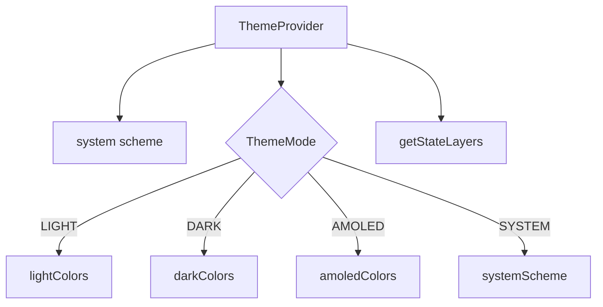

## 18.2 Modes

| Mode | Behavior | File:Line |
|---|---|---|
| SYSTEM (default) | follows `useColorScheme()` | `ThemeProvider.tsx:27-31` |
| LIGHT | `lightColors` | `:34-39` |
| DARK | `darkColors` | same |
| AMOLED | `amoledColors` (pure black bg) | same |

Cycle order in UI: SYSTEM → LIGHT → DARK → AMOLED (`settings.tsx:102-107`).

## 18.3 Color Palettes (`colors.ts`)

- **Light** (`:2-51`): primary `#6C63FF`, secondary `#03DAC5`, tertiary `#FF6584`, background `#FFFFFF`, surface `#F0F2F8`, gradient start `#6C63FF`→`#9C27B0`→`#03DAC5`, premium gold/silver/platinum/rose.
- **Dark** (`:54-103`): primary `#B0A5FF`, background `#121212`, surface `#1E1E2E`.
- **AMOLED** (`:106-111`): dark + background `#000000`, surface `#0A0A0A`, surfaceVariant `#141414`.
- `ThemeColors = typeof lightColors` (`:114`) — all palettes structurally identical.

Extra semantic tokens: `success #2E7D32`, `warning #F57F17`, `info #1565C0`, glass colors, scrim, inverse surfaces.

## 18.4 Typography (`typography.ts`)

Material Design type scale, all using **Cairo** font family (`:3,22`):
`displayLarge(57) → labelSmall(11)`; `mono` uses Menlo/monospace on iOS/Android (`:22`).

## 18.5 Supporting Theme Files (`src/core/theme/`)

| File | Exports |
|---|---|
| `spacing.ts` | spacing scale (xs→xxxl) |
| `breakpoints.ts` | responsive breakpoints |
| `elevation.ts` | shadow/elevation presets (used in vault.tsx, AddOptionsSheet) |
| `icons.ts` | icon name registry |
| `motion.ts` | animation durations |
| `neu.ts` | neumorphic tokens |
| `state.ts` | `getStateLayers(colors,isDark)` → StateLayer for primary/surface/surfaceVariant/error |
| `index.ts` | barrel |

## 18.6 Consumed Design Tokens

- `spacing.*` used in every screen style object.
- `elevations[n]` used: vault card grid (`vault.tsx:109`), FAB (`:181`), sheets (`AddOptionsSheet.tsx:132`, `VaultListSheet.tsx:106`).
- `borderRadius.*` used in cards/sheets (`vault.tsx:157-162`, sheets).
- `gradient` used in welcome hero (`welcome.tsx:30`).
- `stateLayers` exposed by provider but not directly consumed by components in survey.
- `neu.ts`, `motion.ts`, `breakpoints.ts`, `icons.ts` — exported; usage limited (design-system surface for future).

## 18.7 Responsive Hook

`useResponsive` (`src/ui/hooks/useResponsive.ts`) — `scaleSize` used for welcome hero paddings (`welcome.tsx:16,33`). Other screens use `Dimensions.get('window')` directly (`vault.tsx:14`, `create-vault.tsx:25`).
# 19 — i18n & Localization

## 19.1 Setup (`src/core/i18n/index.ts`)

- Library: **i18next + react-i18next** (`:1-2`).
- Sources: `locales/ar.json`, `locales/en.json` (`:5-6`).
- System language from `expo-localization` `getLocales()` (`:8-11`).
- **RTL forced at import**: `I18nManager.forceRTL(isRTL)` + `swapLeftAndRightInRTL(isRTL)` where `isRTL` = any locale has `textDirection==='rtl'` (`:13-16`).
- Init: `lng = systemLanguage==='ar' ? 'ar':'en'`, `fallbackLng='en'`, `compatibilityJSON:'v4'` (`:18-29`).

## 19.2 API

| Function | Behavior | Line |
|---|---|---|
| default `i18n` | instance | `:31` |
| `changeLanguage(lang)` | change + forceRTL/swap when mismatch | `:33-40` |
| `getCurrentLanguage()` | 'ar' if language startsWith 'ar' else 'en' | `:42-44` |

## 19.3 Usage in Screens

Every screen uses `useTranslation()` → `t('key')`. Examples:
- `welcome.tsx:2,14` — `t('app.name')`, `t('welcome.features.*')`.
- `settings.tsx:6,58` — theme/language labels; language toggle calls `changeLanguage` + `Updates.reloadAsync()` (`:116-124`).
- `passwords.tsx:5` — `t('passwords.categories.*')`.
- `about.tsx` — `t('about.*')` for vision/mission/values/timeline.

## 19.4 Locale Files

| File | Coverage | Notes |
|---|---|---|
| `ar.json` | full UI (auth, tabs, settings, modals, errors, common) | Arabic-first |
| `en.json` | full UI | fallback |

Both contain namespaces like `app`, `common`, `errors`, `auth`, `vault`, `files`, `media`, `notes`, `passwords`, `settings`, `activityLog`, `about`, `welcome`. Translations were authored during the "Arabic rewrite" phase (see `docs/vault-system/10-final-report.md`).

## 19.5 RTL Handling Summary

| Aspect | Implementation |
|---|---|
| Direction at boot | `I18nManager.forceRTL(systemRTL)` (`:15`) |
| Direction on switch | `changeLanguage()` (`:36-39`) |
| Layout flip | `swapLeftAndRightInRTL` (boot + switch) |
| Manual RTL overrides | `vault.tsx:169` `writingDirection:'rtl'` on card label |
| Font | Cairo supports Arabic |

## 19.6 Gaps / Observations

1. `activity-log.tsx:79` hardcodes `toLocaleString('ar')` regardless of selected language.
2. `settings.tsx:314` shows `'العربية'` hardcoded for the Arabic label; English label uses `t('settings.english')`.
3. Language preference is **not persisted** (state only in settings screen); app reloads use system locale.
4. `biometric-setup` uses `t('settings.biometricAuthPrompt')` for its prompt message — cross-namespace reuse.
5. `en.json` referenced a `files.fileType` key used with interpolation (`file-preview.tsx:101`).
# 20 — Hooks Registry

All hooks in `src/ui/hooks/`. Exported via `hooks/index.ts`.

## 20.1 Used Hooks

### useVaults (`useVaults.ts`)
State: `vaults, loading, error`. Resolves 5 use cases from DI (`:15-19`).
| Exposed | Behavior | Line |
|---|---|---|
| `loadVaults()` | GetVaultsUseCase → setVaults | `:21-31` |
| `createVault(input)` | CreateVaultUseCase, prepends result | `:33-39` |
| `deleteVault(id)` | DeleteVaultUseCase, filters out | `:41-47` |
| `lockVault(id)` | LockVaultUseCase, marks isLocked | `:49-55` |
| `unlockVault(id,pin)` | UnlockVaultUseCase, marks unlocked | `:57-63` |
- `useEffect` auto-load on mount (`:65-67`).
- Consumed by: welcome indirectly via create; vault.tsx, settings.tsx, login.tsx, create-vault.tsx, AddOptionsSheet, VaultListSheet.

### useBiometrics (`useBiometrics.ts`)
State: `isAvailable, isEnrolled, biometryType`; methods `checkBiometrics()`, `authenticate(prompt?)`. Full detail in `05`.
Consumed by: login.tsx, biometric-setup.tsx, settings.tsx.

### useSecureStorage (`useSecureStorage.ts`)
Wraps a module-level `SecureStorageSource` instance (`:4`).
| Exposed | Line |
|---|---|
| `setItem(key,value)` | `:9-16` |
| `getItem(key)` | `:18-20` |
| `deleteItem(key)` | `:22-24` |
| `loading` flag | `:7` |
Consumed by: login.tsx (remember), settings.tsx (flags).

### useResponsive (`useResponsive.ts`)
Exposes `scaleSize` for responsive sizing. Used only in `welcome.tsx:16`.

## 20.2 Unused Hooks (exported only)

### useAppState (`useAppState.ts`)
`useAppState(onForeground?, onBackground?)` — AppState listener. **Not used**; `SessionProvider` duplicates this logic inline (`SessionProvider.tsx:76-97`).

### useDebounce (`useDebounce.ts`)
Debounce helper. **Not used** — search inputs filter directly (`files.tsx:24-26`, `notes.tsx:146-148`, `passwords.tsx:189-191`, `media.tsx:169-171`).

## 20.3 Hook → Screen Usage Matrix

| Hook | welcome | create-vault | login | vault | files | media | notes | passwords | settings |
|---|---|---|---|---|---|---|---|---|---|
| useVaults | | ✓ | ✓ | ✓ | | | | | ✓ |
| useBiometrics | | | ✓ | | | | | | ✓ |
| useSecureStorage | | | ✓ | | | | | | ✓ |
| useResponsive | ✓ | | | | | | | | |
| useAppState | | | | | | | | | |
| useDebounce | | | | | | | | | |

> Note: AddOptionsSheet & VaultListSheet (organisms) also consume `useVaults` (`AddOptionsSheet.tsx:11,21`, `VaultListSheet.tsx:9,31`).

## 20.4 Implementation Notes

- `useVaults` resolves DI singletons on every render (no `useMemo` on container refs) — acceptable but suboptimal.
- `useSecureStorage` uses a **shared module singleton** instead of DI — mild inconsistency with the DI-first pattern.
- Hooks don't persist to DB/SecureStore except where explicitly called by screens (e.g. auto-lock writes only via settings).
# 21 — Components Registry

UI component inventory under `src/ui/components/` (atoms / molecules / organisms). All re-exported from barrel `components/index.ts`.

## 21.1 Atoms (11)

| Component | Used by | Notes |
|---|---|---|
| `Typography` | everywhere | variant system + color prop |
| `Button` | auth screens, sheets, settings | variants primary/ghost/glass |
| `Input` | auth, passwords, create-folder | labels, error, secure toggle |
| `Card` | settings, about | variant filled/outlined, padding |
| `Icon` | everywhere | wraps MaterialCommunityIcons with glyph map typing |
| `Loading` | all screens | fullScreen mode |
| `ErrorView` | files/media/notes/passwords, file-preview | retry button |
| `EmptyState` | files/media/notes/passwords | icon/title/desc/action |
| `Divider` | settings, screen rows | |
| `Skeleton` | **unused** | dead |
| `Snackbar` | **unused** | dead |

## 21.2 Molecules (10)

| Component | Used by | Notes |
|---|---|---|
| `Header` | ScreenLayout only | title/subtitle/back/right-action |
| `SearchBar` | files/media/notes/passwords | search + clear |
| `FloatingButton` | files/media/notes/passwords | FAB |
| `FileRow` | FilesList | row + selection |
| `MediaThumb` | MediaGallery | thumb + selection |
| `MediaGallery` | media.tsx | gallery grid + refresh |
| `MediaPreview` | media.tsx | full preview + export |
| `BottomSheet` | **unused** | dead (AddOptionsSheet uses Modal) |
| `Dialog` | **unused** | dead |
| `GlassCard` | **unused** | dead |

## 21.3 Organisms (8)

| Component | Used by | Notes |
|---|---|---|
| `ScreenLayout` | every screen | status bar, header, safe area, edges |
| `AddOptionsSheet` | vault.tsx | add-file/photo/video/audio/note/password/exit |
| `VaultListSheet` | vault.tsx | vault switcher + create |
| `FilesList` | files.tsx | list + EmptyState + refresh |
| `SelectionBar` | files/media/notes/passwords | bulk action bar |
| `RenameEditor` | files.tsx | inline rename |
| `VaultCard` | **unused** | dead |
| `ItemRow` | **unused** | dead |

## 21.4 Templates

`templates/index.ts` — empty placeholder (no templates implemented).

## 21.5 Component → Screen Matrix

| Screen | ScreenLayout | Typography | Icon | Button | Input | Card | SearchBar | SelectionBar | FAB | Empty/Error/Loading |
|---|---|---|---|---|---|---|---|---|---|---|
| welcome | | ✓ | ✓ | ✓ | | | | | | |
| create-vault | | ✓ | ✓ | ✓ | ✓ | | | | | |
| login | | ✓ | ✓ | ✓ | ✓ | | | | | |
| biometric-setup | | ✓ | ✓ | ✓ | | | | | | |
| vault | ✓ | ✓ | ✓ | | | | | | ✓ | |
| files | ✓ | | | | | | ✓ | ✓ | ✓ | ✓ |
| media | ✓ | | | | | | ✓ | ✓ | ✓ | ✓ |
| notes | ✓ | ✓ | ✓ | | | | ✓ | ✓ | ✓ | ✓ |
| passwords | ✓ | ✓ | ✓ | ✓ | ✓ | | ✓ | ✓ | ✓ | ✓ |
| settings | ✓ | ✓ | ✓ | | | ✓ | | | | |
| modals (4) | ✓ | ✓ | ✓ | ✓ | ✓ | ✓ | | | | ✓ |

## 21.6 Usage Stats (verified)

- `ScreenLayout` imported by all 10 main screens + 4 modals.
- `EmptyState`: 4 screens (`files/media/notes/passwords`).
- `SelectionBar`: 4 screens.
- `FloatingButton`: 3 screens (files/media/notes/passwords → 4 actually; files:284, media:214, notes:270, passwords:305).
- Dead components: 7 (see table) — see `14-Hidden-Features.md`.
# 22 — Permissions

## 22.1 Declared Permissions (`app.json`)

### Android
```
permissions:
  android.permission.USE_BIOMETRIC
  android.permission.READ_EXTERNAL_STORAGE
  android.permission.WRITE_EXTERNAL_STORAGE
  android.permission.READ_MEDIA_IMAGES
  android.permission.READ_MEDIA_VIDEO
  android.permission.READ_MEDIA_AUDIO

blockedPermissions:
  android.permission.RECORD_AUDIO
  android.permission.SYSTEM_ALERT_WINDOW
  android.permission.CAMERA
```

### iOS
- `NSFaceIDUsageDescription`: "Khaznati uses Face ID to protect your vault."

## 22.2 Runtime Permission Requests (code)

| Permission | Requested by | When | File:Line |
|---|---|---|---|
| Biometric | `expo-local-authentication` | prompt shown on demand | `useBiometrics.ts:79-84` |
| Media library (save) | `expo-media-library` | media export / files export | `media.tsx:149`, `files.tsx:160` |
| Document picker | `expo-document-picker` | file/backup import | `files.tsx:93`, `settings.tsx:164`, `AddOptionsSheet.tsx:30` |
| Image picker | `expo-image-picker` | media import | `media.tsx:104` |
| Clipboard | `expo-clipboard` | password copy | `passwords.tsx:140` |
| Sharing | `expo-sharing` | backup share | `settings.tsx:144-149` |

## 22.3 Permission-to-Feature Map

| Feature | Required permission | Request timing | Behavior if denied |
|---|---|---|---|
| Media import (gallery) | image-picker (uses system) | on tap | `canceled` → no-op |
| Media export | media-library WRITE | on export | `Alert(permission)` (`media.tsx:150-153`) |
| File export | media-library WRITE | on export | `Alert(permission)` (`files.tsx:161-164`) |
| Biometric unlock | USE_BIOMETRIC + enrollment | on biometric tap | button hidden unless available (`login.tsx:167`) |
| Backup share | sharing (no permission) | on backup | fallback Alert path |
| Restore | document-picker (system UI) | on restore | cancel → no-op |

## 22.4 Declared vs Needed

- **Storage permissions declared** (READ/WRITE_EXTERNAL_STORAGE + READ_MEDIA_*) — required because media library write needs them on older Android; file-system ops use app-private dirs (`Paths.document`) that don't need storage permission.
- **CAMERA blocked** — no camera feature; picker uses gallery only.
- **RECORD_AUDIO blocked** — no recording; only audio file import.
- **SYSTEM_ALERT_WINDOW blocked** — security hardening.
- Note: `expo-image-picker` with `mediaTypes:['images']` and no camera permission works for gallery; camera would require `CAMERA` which is blocked.

## 22.5 Security Rationale

- Least-privilege: only biometric + media-library + storage for import/export.
- Blocking RECORD_AUDIO/SYSTEM_ALERT_WINDOW/CAMERA reduces attack surface.
- `app.json` `ios.supportsTablet:false` — tablet not supported.
- `updates.enabled:false` — no OTA binary updates.
# 23 — Data Formats

DTOs, mappers, and on-disk formats.

## 23.1 DTO ↔ Entity Mapping (all in `src/data/dto` + `src/data/mappers`)

Snake_case DB columns ↔ camelCase entities. Five pairs:

| Entity | DTO | Mapper | Key columns |
|---|---|---|---|
| Vault | VaultDTO | VaultMapper | all 16 columns incl. encrypted_pin_hash, pin_salt, failed_attempts, locked_until, item_count, total_size, backup_version |
| Item | ItemDTO | ItemMapper | name, type, mime_type, size, encrypted_path, encrypted_data, thumbnail_path, metadata_json, is_favorite, is_deleted, deleted_at |
| Note | NoteDTO | NoteMapper | title, encrypted_content, is_encrypted, color, is_pinned |
| Password | PasswordDTO | PasswordMapper | service_name, service_url, username, encrypted_password, category, notes, strength_score, last_used_at |
| ActivityLog | ActivityLogDTO | ActivityLogMapper | action, target_type, target_id, metadata_json, vault_id, created_at |

Mapper pattern: `toDTO(entity)` / `toEntity(dto)` (e.g. `VaultMapper.ts:17,39`).

## 23.2 Encrypted Payload Format (crypto.ts)

**Hex string layout**: `[IV 12B][TAG 16B][ciphertext]` (`crypto.ts:67-71`).
- For `encryptData/decryptData` → hex string (DB text columns).
- For `encryptFile/decryptFile` → base64 string (`.enc` files, `media.tsx:116,136`).

## 23.3 Backup File Format (`.kzb`)

| Aspect | Value | Evidence |
|---|---|---|
| Extension | `.kzb` | settings.tsx:134,140 |
| Content | **raw copy** of `SQLite/khaznati.db` | settings.tsx:138-142 |
| Magic header | `KHAZNAti` (config only, unused) | config.ts:42 |
| Checksum | config backup has none; `backup_metadata` table has checksum column but no writer | schema.ts:93 |
| Versioning | `backup_version` column default 0 (unused beyond default) | CreateVaultUseCase.ts:54 |

## 23.4 File-System Naming

| Purpose | Pattern | Example | Evidence |
|---|---|---|---|
| Files dir | `document/khaznati/{vaultId}/` | `khaznati/abc/` | files.tsx:22 |
| Media enc file | `.encrypted_media/{ts}.{ext}.enc` | `1690000000000.jpg.enc` | MediaStorage.ts:37 |
| Backup file | `backups/khaznati-backup-{ts}.kzb` | `khaznati-backup-1712345678901.kzb` | settings.tsx:134,140 |
| Export temp | `cache/khaznati_export/{name}` | | media.tsx:155-158, files.tsx:167-171 |

## 23.5 SecureStore Key-Value Formats

| Key | Value type | Written by |
|---|---|---|
| `db_encryption_key` | 64-hex | DatabaseService.ts:27 |
| `biometric_pin_{vaultId}` | plaintext PIN string | BiometricUnlockUseCase.ts:38 |
| `note_vault_key_{vaultId}` | 64-hex | NoteRepositoryImpl.ts:23 |
| `pwd_vault_key_{vaultId}` | 64-hex | PasswordRepositoryImpl.ts:23 |
| `media_vault_key_{vaultId}` | 64-hex | MediaStorage.ts:15 |
| `biometric_enabled` | `'true'` | biometric-setup.tsx:24 |
| `auto_lock_timeout` | ms number string | settings.tsx:95 |
| `clipboard_protection` | `'true'`/`'false'` | settings.tsx:87 |
| `khaznati_remember_vault_{vaultId}` | `'true'` | login.tsx:63 |

## 23.6 ID & Time Formats

- IDs: UUID v4 via `generateId()` (`src/core/utils/id.ts`).
- Timestamps: epoch ms integers (`Date.now()`, `now()` util) — all `created_at/updated_at` columns.

## 23.7 Metadata JSON

- `items.metadata_json` — free-form object for items (used with `null` in current flows).
- `activity_log.metadata_json` — JSON string of action context (`ActivityLogRepositoryImpl.ts:29`).

## 23.8 Settings Key/Value

`settings` table stores all 17 settings as `key → string(value)` pairs; booleans as `'true'`/`'false'`; numbers as strings (`SettingsRepositoryImpl.ts:65-68`).
# 24 — Storage Locations

Map of every on-device storage location, its content, and encryption status.

## 24.1 Storage Map (Mermaid)

```mermaid
graph TD
  ROOT[expo-file-system Paths.document] --> SQLITE[SQLite/khaznati.db]
  ROOT --> KHAZ[khaznati/]
  KHAZ --> V1[khaznati/{vaultId}/ files tab]
  KHAZ --> ENC[.encrypted_media/*.enc]
  ROOT --> BK[backups/khaznati-backup-*.kzb]
  CACHE[Paths.cache] --> EXP[khaznati_export/ temp]
  SECURE[expo-secure-store] --> KEYS[keys/flags/PIN]
```

## 24.2 Locations Detail

| Location | Contents | Encrypted | Producer | Consumer |
|---|---|---|---|---|
| `document/SQLite/khaznati.db` | relational DB (vaults/items/notes/passwords/log/settings) | Partial (optional PRAGMA key) | DatabaseService | all repositories |
| `document/SQLite/khaznati.db-wal/-shm` | WAL journal files | — | SQLite WAL mode | expo-sqlite |
| `document/khaznati/{vaultId}/` | imported files (raw) | **No** | files.tsx `copyImportedFile` | FilesList, file-preview |
| `document/khaznati/{vaultId}/.encrypted_media/*.enc` | encrypted image payloads (base64 text) | Yes (encryptFile) | MediaStorage.persistEncryptedImage | media.tsx decrypt |
| `document/backups/*.kzb` | DB backup copies | DB-level | settings.tsx backup | settings.tsx restore |
| `cache/khaznati_export/` | temp export files | No (transient) | media/files export | media-library save; deleted after |
| SecureStore | keys + flags + biometric PIN + remember | OS-level | many | many |

## 24.3 File-System API

- Uses the modern **`expo-file-system`** API: `Paths.document`, `Paths.cache`, `Directory`, `File` (e.g. `settings.tsx:4`, `media.tsx:5`, `files.tsx:5`).
- `DatabaseService` uses **legacy** API (`expo-file-system/legacy`) for `documentDirectory`, `copyAsync`, `makeDirectoryAsync` (`DatabaseService.ts:2,18,133-141`).

## 24.4 Storage Lifecycle

- **Create**: dirs created lazily on first use with `create({ intermediates:true, idempotent:true })`.
- **Delete**: 
  - Single file delete: `new File(id).delete()` (files.tsx:145,188; media.tsx:87).
  - Vault dir delete (clear-all): `khaznatiDir.delete()` (settings.tsx:210).
  - DB delete: never in normal flow; clear-all deletes vaults via repo.
- **No** recycle-bin/trash; soft-delete flag exists in items schema but Files tab does hard delete.

## 24.5 Persistence of App State

| State | Where | Lifetime |
|---|---|---|
| Theme mode | React state (ThemeProvider) | in-memory only |
| Language | i18next state | in-memory only |
| Session (unlocked/active vault) | React state (SessionProvider) | in-memory; auto-lock clears |
| Auto-lock timeout | SecureStore `auto_lock_timeout` | persistent |
| Vault data | SQLite | persistent |

## 24.6 Backup Coverage Gaps

- Backup copies **only** the DB file — encrypted media files (`.encrypted_media`), imported raw files, and SecureStore keys are **not** backed up. Restoring a backup without the SecureStore keys yields undecryptable content.
- Restore does not verify checksum/integrity beyond DB self-check.
# 25 — Error Handling

## 25.1 Error Model (`src/core/errors/index.ts`)

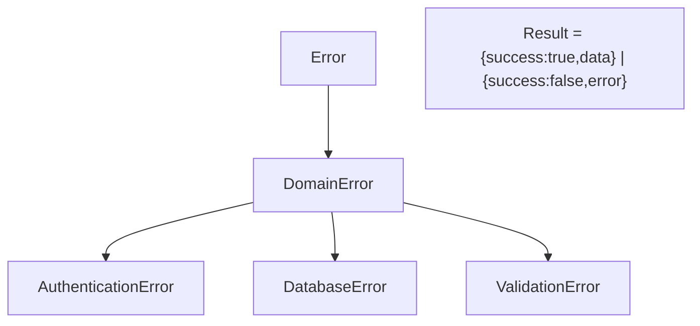

| Class | Code | Construct | Line |
|---|---|---|---|
| `DomainError` | — | (message, code, metadata?) | `:2-13` |
| `AuthenticationError` | `AUTH_FAILED` | reason → metadata.reason | `:16-20` |
| `DatabaseError` | `DATABASE_ERROR` | message + cause | `:23-27` |
| `ValidationError` | `VALIDATION_ERROR` | field + reason | `:30-37` |
| `success(data)` / `failure(error)` | — | factories | `:45-51` |

## 25.2 Error Handling Pattern (data + domain)

Every repository method:
```ts
try { ...db call... return success(result); }
catch (e) { return failure(new DatabaseError('msg', (e as Error).message)); }
```
Examples: `VaultRepositoryImpl.ts:15-30`, `NoteRepositoryImpl.ts:28-43`, `PasswordRepositoryImpl.ts:28-45`, `ItemRepositoryImpl.ts:16-34`, `ActivityLogRepositoryImpl.ts:17-41`.

Use cases return `failure(new ValidationError(...))` / `failure(new AuthenticationError(...))` on business-rule violations (`CreateVaultUseCase.ts:24-32`, `UnlockVaultUseCase.ts:15-52`).

## 25.3 Screen-Level Handling

| Screen | Pattern | Examples |
|---|---|---|
| Login | `setError(result.error.message)`; clears PIN | `login.tsx:67-68` |
| Create vault | `setError(result.error.message)` / catch | `create-vault.tsx:70-76` |
| Files/Media/Notes/Passwords | `setError(msg)` + `ErrorView` w/ retry | `files.tsx:38-40,75-79`, `media.tsx:51-56` |
| Settings | `Alert.alert(t('common.error'), msg)` on backup/restore | `settings.tsx:157-159,190-192` |
| File preview | `setError` + ErrorView | `file-preview.tsx:53-56` |

## 25.4 Silent Failure Modes (documented)

| Location | Behavior | Risk |
|---|---|---|
| `decryptData` / `decryptFile` | return `'[encrypted]'` / `''` on any error | data appears "encrypted" when tampered/undecryptable; no user-visible error |
| DB PRAGMA key | `catch {}` warn-only (`DatabaseService.ts:31-35`) | DB may run unencrypted silently |
| `useBiometrics.authenticate` | catch → false | indistinguishable failure |
| Repos' decrypt loops | per-entry `'[encrypted]'` | mixed decrypted/undecryptable lists |

## 25.5 Validation Errors

- `validatePin` / `validateVaultName` / `validatePassword` return `{valid,error?}` from zod (`validators/index.ts:45-59`).
- Form screens do their own checks (name non-empty, PIN match/length) before submit (`create-vault.tsx:59-61`).

## 25.6 Logging

`logger` (`src/core/utils/logger.ts`) used at boot + DB ops:
- `app/_layout.tsx:75,77,79` — integrity warning, init success/fail.
- `DatabaseService.ts:34,44,93,121,142,158` — warnings/info.

## 25.7 Error UX Summary

- All data-layer failures surface as generic messages; no error codes surfaced to user.
- No global error boundary / crash reporting (no Sentry/Bugsnag).
- React error handling relies on local try/catch + Alert/ErrorView only.
# 26 — Build & CI/CD Pipeline

## 26.1 Local Scripts (`package.json`)

| Script | Command |
|---|---|
| `test` | `jest` |
| `lint` | `eslint` |
| `typecheck` | `tsc --noEmit` |
| `start` / `android` / `ios` / `web` | expo standard |
| offline install | `install.sh`, `install-offline.sh` (vendor docs in `packages.md`) |

## 26.2 Build Profiles (`eas.json`)

EAS build profiles exist (reviewed earlier); offline release uses manual `expo prebuild` + Gradle in CI.

## 26.3 GitHub Actions Workflows

### ci.yml (fast PR gate)
- Triggers: push/PR to main.
- Node 22, `npm ci --legacy-peer-deps`, then `npm run typecheck`, `npm run lint`, `npm test` (`.github/workflows/ci.yml:10-28`).

### build.yml (main pipeline)
1. **verify** job: Node 22, typecheck + eslint + tests (`:17-39`).
2. **build-android** job (needs verify): Node 22 + Java 17 + Android SDK; cache Gradle; `npx expo prebuild --platform android --no-install`; append Gradle tuning (`:80-87`); optional release signing from secrets with debug fallback (`:89-113`); warm Gradle caches; `./gradlew assembleRelease -x lint` (`:122-126`); upload APK + mapping artifacts (`:128-141`).
3. **release** job (tags `v*` only): download APK → `softprops/action-gh-release` with release notes (`:143-163`).

### build-android.yml (manual dispatch)
- verify job + build job producing **debug** then **release** (release only on main/master) (`:30-95`).

## 26.4 Build Tuning (Gradle)

Appended in build.yml:
```
org.gradle.jvmargs=-Xmx4g -XX:MaxMetaspaceSize=1g -XX:+UseParallelGC
org.gradle.parallel=true
org.gradle.caching=true
```

## 26.5 Signing

- Secrets: `ANDROID_KEYSTORE_BASE64`, `ANDROID_KEYSTORE_PASSWORD`, `ANDROID_KEY_ALIAS`, `ANDROID_KEY_PASSWORD`.
- If unset → debug signing fallback (notice emitted) (`build.yml:96-99`).
- Python script patches `android/app/build.gradle` to add `release` signing config (`build.yml:107-113`).
- `storeType 'PKCS12'`, `signingConfig signingConfigs.release`.

## 26.6 Artifacts

| Artifact | Path | Retention |
|---|---|---|
| `app-release.apk` | `android/app/build/outputs/apk/release/` | 30 days |
| `mapping.txt` | `android/app/build/outputs/mapping/release/` | 30 days (ignore if missing) |
| Release GH asset | from tag workflow | persistent |
| Local `khaznati-release/khaznty.apk` (96 MB) | repo | committed manually |

## 26.7 Verification Steps (OSS audit)

| Check | Command | Status expected |
|---|---|---|
| TypeScript | `npx tsc --noEmit` | 0 errors |
| Lint | `npx eslint . --ext .ts,.tsx` | 0 errors (warnings allowed per build.yml relax) |
| Tests | `npm test` | 4 test files (see `27`) |

## 26.8 Notes

- `--legacy-peer-deps` used everywhere due to RN 0.81 + React 19 peer-range mismatches.
- CI pins Node 22 (and 20 in manual workflow).
- Prebuild runs at CI time (android/ is generated, though present in repo).
- Offline release: `khaznati-release/khaznty.apk` built Jul 31 (per git log).
# 27 — Test Coverage

## 27.1 Test Infrastructure

| Item | Config |
|---|---|
| Framework | Jest 29 |
| Preset | `jest-expo` |
| Libraries | `@testing-library/react-native`, `@testing-library/jest-native`, `react-test-renderer` |
| Mocks | `__mocks__/expo-crypto.js` (mocks digest/getRandomBytes) |
| Location | `__tests__/unit/...` |
| CI runs | `npm test` in all 3 workflows |

## 27.2 Test Files

| Test | Subject | Coverage |
|---|---|---|
| `__tests__/unit/core/utils/secure.test.ts` | `hashPin`, `generateSalt`, `clamp`, `debounce`, `delay` | unit |
| `__tests__/unit/core/validators/index.test.ts` | `validatePin`, `validateVaultName`, schemas | unit |
| `__tests__/unit/data/mappers/VaultMapper.test.ts` | DTO ↔ entity round-trip | unit |
| `__tests__/unit/domain/usecases/vault/CreateVaultUseCase.test.ts` | validation + create + biometric store | unit |

## 27.3 Coverage Areas vs Untested

| Area | Tested? |
|---|---|
| Crypto (encrypt/decrypt round-trip) | **No** (only crypto mocks for hashing utils) |
| All repositories (SQL, encryption, counts) | **No** |
| All screens / navigation | **No** |
| Unlock/lockout logic | **No** (CreateVault tested only) |
| Session auto-lock | **No** |
| i18n / RTL | **No** |
| UI components | **No** |

> Note: `@testing-library/react-native` is installed but no component tests found.

## 27.4 Test Commands

```bash
npm test                # jest
npx jest --coverage     # coverage (not configured in CI)
```

## 27.5 Observations

1. Coverage is minimal (4 unit files) — only core utils, validators, one mapper, one use case.
2. `expo-crypto` mocked globally (`__mocks__/expo-crypto.js`) — `hashPin` tests run against mocked digest.
3. No tests for security-critical flows (lockout, biometric, encryption) despite being the product's core value.
4. No mocks for expo-sqlite/file-system/media-library — repository tests would require them.
# 28 — Risk Areas & Vulnerabilities

Prioritized findings from the OSS survey. All are observations — **no fixes applied**.

## 28.1 Critical Risks

| # | Risk | Location | Impact |
|---|---|---|---|
| R1 | **Files tab stores imported files unencrypted** on disk | `files.tsx:22-31` `copyImportedFile` + `files.tsx:98-115` | Sensitive user files accessible in app sandbox if device compromised; contradicts "everything encrypted" claim |
| R2 | **Non-standard cipher** — custom SHA-256 stream+XOR, truncated tag; not AES-GCM despite config label | `crypto.ts:30-72,142-236`, `config.ts:23` | Undocumented crypto; no external audit; potential misuse risks |
| R3 | **DB encryption silent fallback** — PRAGMA key errors swallowed | `DatabaseService.ts:31-35` | App can run with plaintext DB without any warning |
| R4 | **Plaintext PIN stored in SecureStore** for biometric unlock | `BiometricUnlockUseCase.ts:36-41`, `create-vault.tsx:67-68` | Root/Keystore compromise leaks PIN |
| R5 | **Biometric path bypasses lockout** — `BiometricUnlockUseCase.execute` doesn't check failed attempts and doesn't require fresh biometric itself | `BiometricUnlockUseCase.ts:14-34`, `login.tsx:73-86` | Reduces brute-force protection |

## 28.2 High Risks

| # | Risk | Location |
|---|---|---|
| R6 | `Math.random` password generator (not CSPRNG) | `passwords.tsx:66-73` |
| R7 | Backup excludes encrypted media files + keys — restore yields undecryptable DB rows | `settings.tsx:126-160`, `24-Storage-Locations.md §6` |
| R8 | Media export writes base64 **text** into file (not decoded binary) | `media.tsx:155-158` |
| R9 | `decryptData`/`decryptFile` silently return placeholders on tamper/error — no user feedback | `crypto.ts:128-130,233-235` |
| R10 | Activity log never populated (`.log()` never called) | `ActivityLogRepositoryImpl.ts:17-41` |

## 28.3 Medium Risks

| # | Risk | Location |
|---|---|---|
| R11 | Dead settings advertise protections that don't exist (root detection, secure delete, clipboard clear, auto backup) | `SettingsRepositoryImpl.ts:15-21`, `settings.tsx:84-88` |
| R12 | Remember-me is a flag only, not secure token; doesn't persist session across restarts properly | `login.tsx:19,44-50` |
| R13 | No input sanitization beyond zod basics; no injection surface analysis (SQL params used — good) | `validators/index.ts` |
| R14 | Theme/language not persisted — resets each launch | `18-Theme`, `19-i18n` |
| R15 | `biometric_enabled` flag ignored by login button visibility | `login.tsx:167` |
| R16 | Unreachable screens (biometric-setup, create-folder) — confusing flow surface | `03-Screens-Registry.md` |
| R17 | No crash reporting / error boundary | `25-Error-Handling.md §7` |
| R18 | Shared `SecureStorageSource` module singleton outside DI in `useSecureStorage.ts:4` | inconsistency |

## 28.4 Low / Cosmetic

| # | Risk | Location |
|---|---|---|
| R19 | `activity-log.tsx:79` hardcodes Arabic locale formatting | `activity-log.tsx:79` |
| R20 | Duplicate index creation across migrations (harmless) | `09-Migrations-History.md §3` |
| R21 | `useVaults` re-resolves DI each render | `useVaults.ts:15-19` |
| R22 | Hardcoded version strings `Khaznati v1.0.0` in settings/about | `settings.tsx:349`, `about.tsx:202` |
| R23 | `en.json` `settings.english` label used as language display | `settings.tsx:314` |

## 28.5 Recommended Next Actions (informational — not performed)

1. Add AES-GCM via a vetted library or document/rename the custom scheme.
2. Encrypt Files-tab imports with the vault key (mirror MediaStorage).
3. Make DB encryption mandatory + warn if PRAGMA key unsupported.
4. Replace `Math.random` with `Crypto.getRandomBytesAsync` for generator.
5. Enforce fresh biometric + lockout checks inside `BiometricUnlockUseCase`.
6. Fix media export to decode base64 → binary before writing.
7. Wire `.log()` calls into vault/item/password actions so activity log works.
8. Extend backup to include media files and vault keys (or document limitation).
9. Add unit tests for crypto round-trips, lockout, and repository layers.
# 29 — OSS Summary (Final Report)

## 29.1 Survey Scope

**Operational System Survey** of **Khaznati (خزنتي)** — an offline-first secure vault app (Expo SDK 54 / React Native 0.81.5 / React 19 / TypeScript). The codebase was **read-only** surveyed; no files modified.

## 29.2 System at a Glance

| Aspect | Summary |
|---|---|
| Architecture | Clean Architecture: `app` (screens) → `ui` (components/hooks/providers) → `domain` (entities/usecases) → `data` (DB/repos) + `core` (utils/DI/theme/i18n) |
| Screens | 16 (4 auth + 6 tabs + 4 modals + redirect), file-based expo-router |
| Database | SQLite (expo-sqlite), 7 tables + `_migrations`, WAL, FK cascade |
| Auth | PIN (iterated SHA-256 ×100k) + biometric (stored-PIN via SecureStore); 5 attempts/5-min lockout |
| Crypto | Custom SHA-256 stream cipher (not AES-GCM despite config label) |
| Storage | SQLite + app-private dirs; media encrypted, files tab plaintext |
| i18n | Arabic-first + English, forced RTL, Cairo font |
| Theme | Light/Dark/AMOLED/SYSTEM via Context |
| DI | Custom Service Locator, 19 singletons |
| CI/CD | 3 GitHub Actions workflows; APK build + release on tags |
| Tests | 4 unit files (utils, validators, one mapper, CreateVaultUseCase) |

## 29.3 Verified File Counts

- Total TS/TSX under `app`+`src`: **146 files**.
- Screens: **20** in `app/`; components: **29** in `src/ui/components/`.
- Domain entities: 6; repo interfaces: 7; use cases: 10; repos: 6; DTOs: 5; mappers: 5.

## 29.4 Key Findings (High-Impact)

1. **Encryption gap in Files tab** — imports copied raw (`files.tsx:22-31`).
2. **Crypto is non-standard** — custom SHA-256 stream; config labels AES-GCM (`crypto.ts`, `config.ts:23`).
3. **DB PRAGMA key silent fallback** (`DatabaseService.ts:31-35`).
4. **Activity log never populated** — no `.log()` calls anywhere.
5. **7 dead components + 2 dead hooks + 5 dead DI registrations + 2 unreachable screens** (see `14`).
6. **Multiple config constants advertise unimplemented features** (root detection, secure delete, clipboard clear, auto-backup, thumbnails, session timeout).
7. **Backup only copies DB** — media files and SecureStore keys excluded, restoring may lose decryptability.
8. **Media export writes base64 text not binary** (`media.tsx:155-158`).

## 29.5 Strengths

- Clean layering and consistent `Result<T>` error handling.
- Per-vault keys for notes/passwords/media; SecureStore isolation.
- WAL + foreign_keys + integrity check at boot.
- Password strength, biometrics, auto-lock, remember-me flows implemented.
- Full Arabic UI + RTL + professional Cairo font.
- Reasonable CI quality gates (typecheck/lint/test).

## 29.6 Weaknesses

- Security-critical areas under-tested; crypto undocumented.
- Dead code / dead routes inflate surface area.
- Advertised security settings not all implemented.
- No crash reporting, no error boundary.
- Settings/theme/language not persisted across restarts.

## 29.7 Documentation Index (this folder)

| # | Doc | # | Doc |
|---|---|---|---|
| 00 | System Overview | 15 | Critical Paths |
| 01 | Files Map | 16 | Services Registry |
| 02 | Navigation | 17 | Configuration Registry |
| 03 | Screens Registry | 18 | Theme & Design System |
| 04 | Authentication Flow | 19 | i18n & Localization |
| 05 | Biometric Auth | 20 | Hooks Registry |
| 06 | Security Audit | 21 | Components Registry |
| 07 | Encryption Impl | 22 | Permissions |
| 08 | Database Schema | 23 | Data Formats |
| 09 | Migrations History | 24 | Storage Locations |
| 10 | Data Repositories | 25 | Error Handling |
| 11 | Use Cases Registry | 26 | Build & CI/CD |
| 12 | Dependency Injection | 27 | Test Coverage |
| 13 | Dependency Graph | 28 | Risk Areas |
| 14 | Hidden Features & Dead Code | 29 | This Summary |

> Next recommended step per OSS process: address `28-Risk-Areas.md` items in a prioritized repair plan (see also `docs/repair-plan.md` in the repo).
